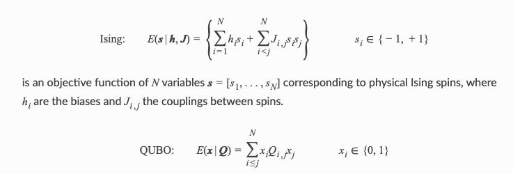
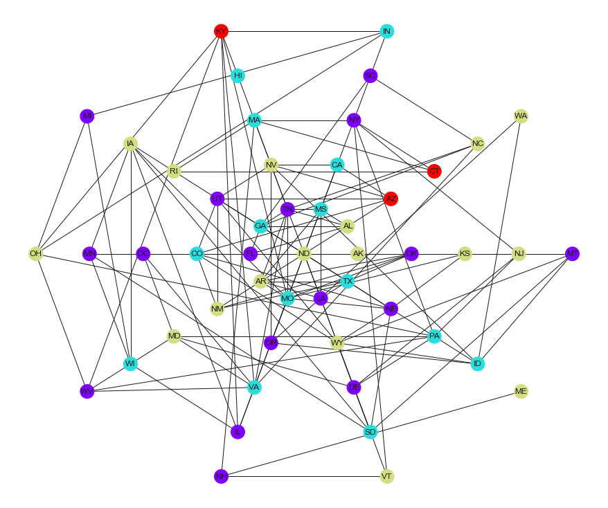

# Quantum Computing with D-Wave Quantum Computer

### Introduction [source](https://docs.dwavesys.com/docs/latest/c_handbook_0.html)
Quantum computing has the potential to help solve some of the most complex technical, scientific, national defense, and commercial problems that organizations face. For quantum computing, as for classical, the first step in solving a problem is to express it in a mathematical formulation compatible with the underlying physical hardware.

D-Wave systems solve problems that can be mapped onto an **Ising model or a quadratic unconstrained binary optimization (QUBO) problem**.




is an objective function of N binary variables represented as an upper-diagonal matrix Q, where diagonal terms are the linear coefficients and the nonzero off-diagonal terms the quadratic coefficients.

The mapped problem must be formulated to be compatible with the constraints of the physical system and as robust as possible to analog control errors.

### Example from constraint satisfaction problem (CSP)

This example solves a map coloring problem to demonstrate an out-of-the-box use of Ocean’s **classical-quantum hybrid sampler, dwave-hybrid Kerberos**, that enables you to solve problems of arbitrary structure and size.

Map coloring is an example of a ***constraint satisfaction problem (CSP)***. CSPs require that all a problem’s variables be assigned values, out of a finite domain, that result in the satisfying of all constraints. The map-coloring CSP is to assign a color to each region of a map such that any two regions sharing a border have different colors.


The Map Coloring advanced example demonstrates lower-level coding of a similar problem, which gives the user more control over the solution procedure but requires the knowledge of some system parameters (e.g., knowing the maximum number of supported variables for the problem). Example Problem With Many Variables demonstrates the hybrid approach to problem solving in more detail by explicitly configuring the classical and quantum workflows.


```python
import networkx as nx
G = nx.read_adjlist('usa.adj', delimiter = ',')   
```

--------

### Quantum Implementation

#### Solution Steps
Section Solving Problems on a D-Wave System describes the process of solving problems on the quantum computer in two steps: 
  - (1) Formulate the problem as a binary quadratic model (BQM) and 
  - (2) Solve the BQM with a D-wave system or classical sampler. In this example, a function in Ocean software handles both steps. Our task is mainly to select the sampler used to solve the problem.


For graph **G(V,E)** of the map problem—no two vertices, V, connected by an edge, E, should select the same color from set **C—construct** a cost function with binary variables, $x_{v,c}=1$ when $v∈V$ selects color $c∈C$, by implementing two constraints:

$$(\sum_c x_{v,c} -1)^2$$

which has minimum energy (zero) when vertices select one color only, and

$$\sum_c \sum_{v_a,v_b \in E} x_{v_a,c} x_{v_b,c},$$

which adds a penalty if the vertices of an edge select the same color.


$$E(x_v,x_{v_a,v_b}) = \sum_v (\sum_c x_{v,c} -1)^2 +
\sum_c \sum_{v_a,v_b \in E} x_{v_a,c} x_{v_b,c}.$$

The minima (ground states) of this QUBO have zero energy for viable solutions. This formulation of the generic problem must still be applied to the map and color set and then embedded.

This section solved the map-coloring problem using a technique of formulating a problem as a constraint satisfaction problem (CSP) using penalty functions. The CSP Reformulation with Penalty Functions section describes this technique and demonstrates it in detail on a simple two-color, two-region part of this map-coloring problem in the Example of CSP reformulation with penalty functions section.


```python
import dwave_networkx as dnx
from hybrid.reference.kerberos import KerberosSampler
```

Prepare coloring scheme using D-Wave kerberoSamplers


```python
coloring = dnx.min_vertex_coloring(G, sampler=KerberosSampler(),\
                                   chromatic_ub=4,\
                                   max_iter=10,\
                                   convergence=3)
set(coloring.values())
```


    {0, 1, 2, 3}


```python
import matplotlib.pyplot as plt
plt.figure(figsize = [12,10])
node_colors = [coloring.get(node) for node in G.nodes()]
if dnx.is_vertex_coloring(G, coloring):  # adjust the next line if using a different map
    nx.draw(G, pos=nx.shell_layout(G, nlist = [list(G.nodes)[x:x+10] for x in range(0, 50, 10)] + [[list(G.nodes)[50]]]), with_labels=True, node_color=node_colors, node_size=400, cmap=plt.cm.rainbow)
plt.show()
```





```python

```
