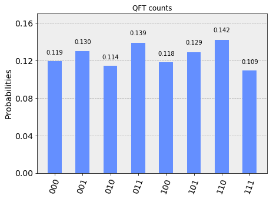

# Quantum Fourier Transform

Quantum Fourier Transform is quantum analogue of Fast Fourier Transform. In quantum computing, the quantum Fourier transform (for short: QFT) is a linear transformation on quantum bits, and is the quantum analogue of the inverse discrete Fourier transform. The quantum Fourier transform is a part of many quantum algorithms, notably Shor's algorithm for factoring and computing the discrete logarithm, the quantum phase estimation algorithm for estimating the eigenvalues of a unitary operator, and algorithms for the hidden subgroup problem. [Wikipedia](https://en.wikipedia.org/wiki/Quantum_Fourier_transform)

------

Import 'Quiskit' libraries

```python
%matplotlib inline
# Importing standard Qiskit libraries and configuring account
from qiskit import QuantumCircuit,QuantumRegister,ClassicalRegister
from qiskit import execute, Aer, IBMQ
from qiskit.compiler import transpile, assemble
from qiskit.tools.jupyter import *
from qiskit.visualization import *
```

-----------

### Theory

QFT is defined as

$$ \large{QFT:|x> = \frac{1}{\sqrt{N}}\sum_{k=0}^{N-1} \omega_{x}^{k}|k>}$$

where  \\( \omega_{x}^{k}\\) is \\( N^{th} (N = 2^{n})\\) root of unity: \\( e^{\frac{2\pi i}{2^{n}}}\\).


$$ QFT_{N} =  \frac{1}{\sqrt{N}} \left( \begin{array}{cccccc} 
1  &         1   &        1       &     1          &   \cdots   &1   \\\
1  &  \omega_{n} & \omega_{n}^{2} & \omega_{n}^{3} &   \cdots   & \omega_{n} ^{N-1} \\\ 
1  &  \omega_{n}^{2} & \omega_{n}^{4} & \omega_{n}^{6} &   \cdots   & \omega_{n} ^{2(N-1)} \\\
1  &  \omega_{n}^{3} &\omega_{n}^{6} & \omega_{n}^{9} &   \cdots   & \omega_{n} ^{3(N-1)} \\\ 
\vdots  & \vdots  & \vdots         & \vdots         &    \dots   & \vdots \\\ 
1  &  \omega_{n}^{(N-1)} & \omega_{n}^{2(N-1)} & \omega_{n}^{3(N-1)} &\cdots   & \omega_{n} ^{(N-1((N-1)} \\\ \end{array} \right) $$


---------

### Single qubit QFT

#### Theory 

For single qubit circuit \\( (n = 1, N = 2^{1} = 2)\\) and \\( \omega_n = e^{\frac{2\pi i}{2^{n}}} = -1 \\).

$$ QFT_{1} = \frac{1}{\sqrt{2}} \left( \begin{array}{cc}
    1  &   1 \\\
    1  &  -1
 \end{array} \right)$$

----------
- How is state |0> transformed ?

$$QFT_1|0> = \frac{1}{\sqrt{2}} \left( \begin{array}{cc}
    1  &   1 \\\
    1  &  -1
 \end{array} \right)  \left( \begin{array}{c}
    1   \\\
    0 
 \end{array} \right) = \frac{1}{\sqrt{2}} \left( \begin{array}{c}
    1   \\\
    1  
 \end{array} \right) = \frac{1}{\sqrt{2}} (|0> + |1>)$$

----------
- How is state |1> transformed ?

$$QFT_1|1> = \frac{1}{\sqrt{2}} \left( \begin{array}{cc}
    1  &   1 \\\
    1  &  -1
 \end{array} \right)  \left( \begin{array}{c}
    0   \\\
    1 
 \end{array} \right) = \frac{1}{\sqrt{2}} \left( \begin{array}{c}
    1   \\\
    -1  
 \end{array} \right) = \frac{1}{\sqrt{2}} (|0> - |1>)$$


---------------
- How is state \\( c_1|0> + c_2|1> \\) transformed?

$$QFT_1(c_1|0> + c_2|1>) = \frac{1}{\sqrt{2}} \left( \begin{array}{cc} 
    1  &   1 \\\
    1  &  -1
\end{array} \right) \left( \begin{array}{cc} 
    c_1   \\\
    c_2
\end{array} \right)$$
$$ = \frac{1}{\sqrt{2}} \left( \begin{array}{cc} 
    c_1 + c_2   \\\
    c_2 - c1
\end{array} \right) = \frac{1}{\sqrt{2}} ((c_1 + c_2)|0> - (c_2 - c1)|1>)$$


--------------

- How to realize the quantum circuit?

It is Hadamard gate !

--------------

### Quantum Circuit - single qubit QFT


###### Quantum Circuit

```python
def qft_1():
    n=1
    qc = QuantumCircuit()
    q = QuantumRegister(n, 'q')
    c = ClassicalRegister(n, 'c')

    qc.add_register(q)
    qc.add_register(c)

    qc.h(q[0])
    return qc,q,c
```

--------

###### Measurement

```python
qc,q,c = qft_1()
qc.measure(q[0], c[0])

# Change the background color in mpl
style = {'backgroundcolor': 'lightgreen'}
qc.draw(output='mpl', style = style)
```


----------------

###### Simulation


```python
simulator = Aer.get_backend('qasm_simulator')
result = execute(qc, simulator).result()
counts = result.get_counts(qc)
plot_histogram(counts, title='QFT counts')
```


----------------

######  Unitary representation

```python
from qiskit.providers.aer import UnitarySimulator
qc,q,c = qft_1()
# Select the UnitarySimulator from the Aer provider
simulator = Aer.get_backend('unitary_simulator')
# Execute and get counts
result = execute(qc, simulator).result()
unitary = result.get_unitary(qc)
print( unitary)
```

-----------

    [[ 0.70710678+0.j  0.70710678+0.j]
     [ 0.70710678+0.j -0.70710678+0.j]]

----------


### Two qubit QFT

#### Theory:

For two qubit circuit, \\( (n =2, N = 2^{2} = 4) \\) where \\( \omega_{n} = e^{\frac{2\pi i}{2^{n}}} = i\\).

$$QFT_2 = \frac{1}{{2}} \left( \begin{array}{cc} 
    1  &   1  &  1  &   1\\\
    1  &   i  &  -1  &  -i\\\
    1  &   -1  &  1  &   -1\\\
    1  &  -i  &  -1  &  i
\end{array} \right)$$

----------
- How is state |00> transformed ?

$$QFT_2|00> = \frac{1}{{2}} \left( \begin{array}{cccc} 
    1  &   1  &  1  &   1\\\
    1  &   i  &  -1  &  -i\\\
    1  &   -1  &  1  &   -1\\\
    1  &  -i  &  -1  &  i
\end{array} \right) \left( \begin{array}{c} 
    1   \\\
    0  \\\
    0  \\\
    0  \\\
\end{array} \right) = \frac{1}{\sqrt{2}} \left( \begin{array}{c} 
    1   \\\
    1   \\\
    1  \\\
    1
\end{array} \right) = \frac{1}{{2}} (|00> + |10> + |01> + |11>)$$


---------------
- How is state \\( c_1|00> + c_2|10> + c_3 |01> + c_4 |11> \\) transformed?

$$QFT_2|(c_1|00> + c_2|10> + c_3 |01> + c_4 |11>) = \frac{1}{{2}} \left( \begin{array}{cccc} 
    1  &   1  &  1  &   1\\\
    1  &   i  &  -1  &  -i\\\
    1  &   -1  &  1  &   -1\\\
    1  &  -i  &  -1  &  i
\end{array} \right) \left( \begin{array}{c} 
    c_1   \\\
    c_2  \\\
    c_3  \\\
    c_4  \\\
\end{array} \right) $$

$$= \frac{1}{{2}} \left( \begin{array}{c} 
    c_1 +c_2 +c_3 +c_4   \\\
    c_1 +ic_2 -c_3 -ic_4   \\\
    c_1 -c_2 +c_3 -c_4  \\\
    c_1 -ic_2 -c_3 +ic_4
\end{array} \right) = \frac{1}{{2}} (d_1|00> + d_2|10> + d_3|01> + d_4|11>)$$

------------


- How to realize the quantum circuit?


$$H \otimes I = \frac{1}{\sqrt{2}} \left( \begin{array}{cc} 
    1  &   1 \\\
    1  &  -1
\end{array} \right) \otimes \left( \begin{array}{cc} 
    1  &   0 \\\
    0  &   1
\end{array} \right)  = \frac{1}{\sqrt{2}}\left( \begin{array}{cccc} 
1 & 0 & 1 & 0\\\
0 & 1 & 0 & 1\\\
1 & 0 & -1 & 0 \\\
0 & 1 & 0 & -1
\end{array} \right) $$

-----------
$$C_{u1} = \left( \begin{array}{cccc}
1 & 0 & 0 & 0\\\
0 & 1 & 0 & 0\\\
0 & 0 & 1 & 0\\\
0 & 0 & 0 & i
\end{array} \right)$$


-------------

$$I \otimes H = \frac{1}{\sqrt{2}} \left( \begin{array}{cc} 
    1  &   0 \\\
    0  &   1
\end{array} \right) \otimes \left( \begin{array}{cc} 
    1  &   1 \\\
    1  &  -1
\end{array} \right)  = \frac{1}{\sqrt{2}}\left( \begin{array}{cccc} 
1 & 1 & 0 & 0\\\
1 & -1 & 0 & 0\\\
0 & 0 & 1 & 1 \\\
0 & 0 & 1 & -1
\end{array} \right) $$

-------------

$$ SWAP = \left( \begin{array}{cccc}
1 & 0 & 0 & 0\\\
0 & 0 & 1 & 0\\\
0 & 1 & 0 & 0\\\
0 & 0 & 0 & 1
\end{array} \right)$$

-----------

$$QFT_2 = (H \otimes I) \times C_{u1} \times (I \otimes H) \times SWAP $$

$$ = \frac{1}{\sqrt{2}}\left( \begin{array}{cccc}
1 & 0 & 1 & 0\\\
0 & 1 & 0 & 1\\\
1 & 0 & -1 & 0 \\\
0 & 1 & 0 & -1
\end{array} \right)\left( \begin{array}{cccc}
1 & 0 & 0 & 0\\\
0 & 1 & 0 & 0\\\
0 & 0 & 1 & 0\\\
0 & 0 & 0 & i
\end{array} \right)\frac{1}{\sqrt{2}}\left( \begin{array}{cccc}
1 & 1 & 0 & 0\\\
1 & -1 & 0 & 0\\\
0 & 0 & 1 & 1 \\\
0 & 0 & 1 & -1
\end{array} \right) \left( \begin{array}{cccc}
1 & 0 & 0 & 0\\\
0 & 0 & 1 & 0\\\
0 & 1 & 0 & 0\\\
0 & 0 & 0 & 1
\end{array} \right)$$

 $$ = \frac{1}{{2}} \left( \begin{array}{cccc}
    1  &   1  &  1  &   1\\\
    1  &   i  &  -1  &  -i\\\
    1  &   -1  &  1  &   -1\\\
    1  &  -i  &  -1  &  i
\end{array} \right)$$

--------------

- Numpy check:


```python
HI = np.array([[1,0,1,0],[0,1,0,1],[1,0,-1,0],[0,1,0,-1]])
CU1 = np.array([[1,0,0,0],[0,1,0,0],[0,0,1,0],[0,0,0,0.+1.j]])
IH = np.array([[1,1,0,0],[1,-1,0,0],[0,0,1,1],[0,0,1,-1]])
SWAP = np.array([[1,0,0,0],[0,0,1,0],[0,1,0,0],[0,0,0,1]])
```


```python
np.dot(HI,np.dot(CU1,np.dot(IH,SWAP)))
```


----------

    array([[ 1.+0.j,  1.+0.j,  1.+0.j,  1.+0.j],
           [ 1.+0.j,  0.+1.j, -1.+0.j,  0.-1.j],
           [ 1.+0.j, -1.+0.j,  1.+0.j, -1.+0.j],
           [ 1.+0.j,  0.-1.j, -1.+0.j,  0.+1.j]])


#### Quantum Circuit - two qubit QFT


```python
import numpy as np
```

###### Quantum circuit

```python
def qft_2():
    n=2
    qc = QuantumCircuit()
    q = QuantumRegister(n, 'q')
    c = ClassicalRegister(n, 'c')

    qc.add_register(q)
    qc.add_register(c)

    qc.h(q[1])
    qc.cu1(np.pi / 2, q[0], q[1])
    qc.h(q[0])
    qc.swap(q[0], q[1])
    return qc,q,c

```

--------------

######  Measurement

```python
qc,q,c = qft_2()

qc.measure(q, c)
# Change the background color in mpl
style = {'backgroundcolor': 'lightgreen'}
qc.draw(output='mpl', style = style)
```


######  Manual approach:

------------

- Initial state: |00>
- After Hadamard Gate on qubit 2 : \\(\frac{1}{\sqrt{2}}|00> + \frac{1}{\sqrt{2}}|01> \\)
- After phase shift Gate : \\(\frac{1}{\sqrt{2}}|00> + \frac{1}{\sqrt{2}}|01> \\)
- After Hadamard Gate on qubit 1 : \\(\frac{1}{{2}}|00> + \frac{1}{{2}}|10>  +  \frac{1}{{2}}|01> - \frac{1}{{2}}|11>\\)
- After SWAP:  \\( \frac{1}{{2}}|00> + \frac{1}{{2}}|01>  +  \frac{1}{{2}}|10> - \frac{1}{{2}}|11>\\)


---------------

###### Simulation


```python
simulator = Aer.get_backend('qasm_simulator')
result = execute(qc, simulator).result()
counts = result.get_counts(qc)
plot_histogram(counts, title='QFT counts')
```


---------------


###### Unitary representation 


```python
from qiskit.providers.aer import UnitarySimulator
qc,q,c = qft_2()
# Select the UnitarySimulator from the Aer provider
simulator = Aer.get_backend('unitary_simulator')
# Execute and get counts
result = execute(qc, simulator).result()
unitary = result.get_unitary(qc)
print( unitary)
```

----------


    [[ 0.5+0.j   0.5+0.j   0.5+0.j   0.5+0.j ]
     [ 0.5+0.j   0. +0.5j -0.5+0.j   0. -0.5j]
     [ 0.5+0.j  -0.5+0.j   0.5+0.j  -0.5+0.j ]
     [ 0.5+0.j   0. -0.5j -0.5+0.j   0. +0.5j]]


-----------

### Quantum Circuit - three qubit QFT

###### Quantum circuit

```python
def qft_3():
    n = 3
    qc = QuantumCircuit()
    q = QuantumRegister(n, 'q')
    c = ClassicalRegister(n, 'c')

    qc.add_register(q)
    qc.add_register(c)

    qc.h(q[2])
    qc.cu1(np.pi / 2, q[1], q[2])
    qc.h(q[1])
    qc.cu1(np.pi / 4, q[0], q[2])
    qc.cu1(np.pi / 2, q[0], q[1])
    qc.h(q[0])
    
    qc.swap(q[0], q[2])
   
    return qc,q,c
```

------------

##### Measuremrnt

```python
qc,q,c = qft_3()
qc.measure(q,c)
# Change the background color in mpl
style = {'backgroundcolor': 'lightgreen'}
qc.draw(output='mpl', style = style)
```


------------

######  Manual Approach:

-----------

- Initial state: |000>
- After Hadamard Gate on 3rd qubit : \\(\frac{1}{\sqrt{2}}(|000> + |001>) \\)
- After CU1 gate on qubit (2,3) : \\(\frac{1}{\sqrt{2}}(|000> + |001>) \\)
- After CU1 gate on qubit (1,3) : \\(\frac{1}{\sqrt{2}}(|000> + |001>) \\)
- After Hadamard Gate on qubit 2 : \\(\frac{1}{{2}}(|000> + |010> +  |001> -|011> )\\)
- After CU1 gate on qubit (0,1): \\(\frac{1}{{2}}(|000> + |010> +  |001> -|011> )\\)
- After Hadamard Gate on qubit 3 : \\(\frac{1}{2\sqrt{2}}(|000> + |001> +  |010> + |011> +  |000> - |001> - |010> + |011)\\)

----------
###### Simulation


```python
simulator = Aer.get_backend('qasm_simulator')
result = execute(qc, simulator).result()
counts = result.get_counts(qc)
plot_histogram(counts, title='QFT counts')
```




-----------------

###### Unitary representation 

```python
from qiskit.providers.aer import UnitarySimulator
qc,q,c = qft_3()
# Select the UnitarySimulator from the Aer provider
simulator = Aer.get_backend('unitary_simulator')
# Execute and get counts
result = execute(qc, simulator).result()
unitary = result.get_unitary(qc)
print( unitary)
```

-----------


    [[ 0.35355339+0.j          0.35355339+0.j          0.35355339+0.j
       0.35355339+0.j          0.35355339+0.j          0.35355339+0.j
       0.35355339+0.j          0.35355339+0.j        ]
     [ 0.35355339+0.j          0.25      +0.25j        0.        +0.35355339j
      -0.25      +0.25j       -0.35355339+0.j         -0.25      -0.25j
       0.        -0.35355339j  0.25      -0.25j      ]
     [ 0.35355339+0.j          0.        +0.35355339j -0.35355339+0.j
       0.        -0.35355339j  0.35355339+0.j          0.        +0.35355339j
      -0.35355339+0.j          0.        -0.35355339j]
     [ 0.35355339+0.j         -0.25      +0.25j        0.        -0.35355339j
       0.25      +0.25j       -0.35355339+0.j          0.25      -0.25j
       0.        +0.35355339j -0.25      -0.25j      ]
     [ 0.35355339+0.j         -0.35355339+0.j          0.35355339+0.j
      -0.35355339+0.j          0.35355339+0.j         -0.35355339+0.j
       0.35355339+0.j         -0.35355339+0.j        ]
     [ 0.35355339+0.j         -0.25      -0.25j        0.        +0.35355339j
       0.25      -0.25j       -0.35355339+0.j          0.25      +0.25j
       0.        -0.35355339j -0.25      +0.25j      ]
     [ 0.35355339+0.j          0.        -0.35355339j -0.35355339+0.j
       0.        +0.35355339j  0.35355339+0.j          0.        -0.35355339j
      -0.35355339+0.j          0.        +0.35355339j]
     [ 0.35355339+0.j          0.25      -0.25j        0.        -0.35355339j
      -0.25      -0.25j       -0.35355339+0.j         -0.25      +0.25j
       0.        +0.35355339j  0.25      +0.25j      ]]


---------------

### Quantum Circuit - four qubit QFT


###### Quantum circuit


```python
def qft_4():
    n = 4
    qc = QuantumCircuit()
    q = QuantumRegister(n, 'q')
    c = ClassicalRegister(n, 'c')

    qc.add_register(q)
    qc.add_register(c)

    qc.h(q[3])
    qc.cu1(np.pi / 2, q[2], q[3])
    qc.h(q[2])
    qc.cu1(np.pi / 4, q[1], q[3])
    qc.cu1(np.pi / 2, q[1], q[2])
    qc.h(q[1])
    qc.cu1(np.pi / 8, q[0], q[3])
    qc.cu1(np.pi / 4, q[0], q[2])
    qc.cu1(np.pi / 2, q[0], q[1])
    qc.h(q[0])
    qc.swap(q[0], q[3])
    qc.swap(q[1], q[2])
    
    
    return qc,q,c
```

--------------

######  Measurement

```python
qc,q,c = qft_4()
qc.measure(q,c)
# Change the background color in mpl
style = {'backgroundcolor': 'lightgreen'}
qc.draw(output='mpl', style = style)
```


--------------

###### Simulation

```python
simulator = Aer.get_backend('qasm_simulator')
result = execute(qc, simulator).result()
counts = result.get_counts(qc)
plot_histogram(counts, title='QFT counts')
```


---------------------------

###### Unitary representation


```python
qc = qft_circuit(4)    
# Select the UnitarySimulator from the Aer provider
simulator = Aer.get_backend('unitary_simulator')
# Execute and get counts
result = execute(qc, simulator).result()
unitary = result.get_unitary(qc)
print( unitary)
```

----------


    [[ 0.25      +0.j          0.25      +0.j          0.25      +0.j
       0.25      +0.j          0.25      +0.j          0.25      +0.j
       0.25      +0.j          0.25      +0.j          0.25      +0.j
       0.25      +0.j          0.25      +0.j          0.25      +0.j
       0.25      +0.j          0.25      +0.j          0.25      +0.j
       0.25      +0.j        ]
     [ 0.25      +0.j          0.23096988+0.09567086j  0.1767767 +0.1767767j
       0.09567086+0.23096988j  0.        +0.25j       -0.09567086+0.23096988j
      -0.1767767 +0.1767767j  -0.23096988+0.09567086j -0.25      +0.j
      -0.23096988-0.09567086j -0.1767767 -0.1767767j  -0.09567086-0.23096988j
       0.        -0.25j        0.09567086-0.23096988j  0.1767767 -0.1767767j
       0.23096988-0.09567086j]
     [ 0.25      +0.j          0.1767767 +0.1767767j   0.        +0.25j
      -0.1767767 +0.1767767j  -0.25      +0.j         -0.1767767 -0.1767767j
       0.        -0.25j        0.1767767 -0.1767767j   0.25      +0.j
       0.1767767 +0.1767767j   0.        +0.25j       -0.1767767 +0.1767767j
      -0.25      +0.j         -0.1767767 -0.1767767j   0.        -0.25j
       0.1767767 -0.1767767j ]
     [ 0.25      +0.j          0.09567086+0.23096988j -0.1767767 +0.1767767j
      -0.23096988-0.09567086j  0.        -0.25j        0.23096988-0.09567086j
       0.1767767 +0.1767767j  -0.09567086+0.23096988j -0.25      +0.j
      -0.09567086-0.23096988j  0.1767767 -0.1767767j   0.23096988+0.09567086j
       0.        +0.25j       -0.23096988+0.09567086j -0.1767767 -0.1767767j
       0.09567086-0.23096988j]
     [ 0.25      +0.j          0.        +0.25j       -0.25      +0.j
       0.        -0.25j        0.25      +0.j          0.        +0.25j
      -0.25      +0.j          0.        -0.25j        0.25      +0.j
       0.        +0.25j       -0.25      +0.j          0.        -0.25j
       0.25      +0.j          0.        +0.25j       -0.25      +0.j
       0.        -0.25j      ]
     [ 0.25      +0.j         -0.09567086+0.23096988j -0.1767767 -0.1767767j
       0.23096988-0.09567086j  0.        +0.25j       -0.23096988-0.09567086j
       0.1767767 -0.1767767j   0.09567086+0.23096988j -0.25      +0.j
       0.09567086-0.23096988j  0.1767767 +0.1767767j  -0.23096988+0.09567086j
       0.        -0.25j        0.23096988+0.09567086j -0.1767767 +0.1767767j
      -0.09567086-0.23096988j]
     [ 0.25      +0.j         -0.1767767 +0.1767767j   0.        -0.25j
       0.1767767 +0.1767767j  -0.25      +0.j          0.1767767 -0.1767767j
       0.        +0.25j       -0.1767767 -0.1767767j   0.25      +0.j
      -0.1767767 +0.1767767j   0.        -0.25j        0.1767767 +0.1767767j
      -0.25      +0.j          0.1767767 -0.1767767j   0.        +0.25j
      -0.1767767 -0.1767767j ]
     [ 0.25      +0.j         -0.23096988+0.09567086j  0.1767767 -0.1767767j
      -0.09567086+0.23096988j  0.        -0.25j        0.09567086+0.23096988j
      -0.1767767 -0.1767767j   0.23096988+0.09567086j -0.25      +0.j
       0.23096988-0.09567086j -0.1767767 +0.1767767j   0.09567086-0.23096988j
       0.        +0.25j       -0.09567086-0.23096988j  0.1767767 +0.1767767j
      -0.23096988-0.09567086j]
     [ 0.25      +0.j         -0.25      +0.j          0.25      +0.j
      -0.25      +0.j          0.25      +0.j         -0.25      +0.j
       0.25      +0.j         -0.25      +0.j          0.25      +0.j
      -0.25      +0.j          0.25      +0.j         -0.25      +0.j
       0.25      +0.j         -0.25      +0.j          0.25      +0.j
      -0.25      +0.j        ]
     [ 0.25      +0.j         -0.23096988-0.09567086j  0.1767767 +0.1767767j
      -0.09567086-0.23096988j  0.        +0.25j        0.09567086-0.23096988j
      -0.1767767 +0.1767767j   0.23096988-0.09567086j -0.25      +0.j
       0.23096988+0.09567086j -0.1767767 -0.1767767j   0.09567086+0.23096988j
       0.        -0.25j       -0.09567086+0.23096988j  0.1767767 -0.1767767j
      -0.23096988+0.09567086j]
     [ 0.25      +0.j         -0.1767767 -0.1767767j   0.        +0.25j
       0.1767767 -0.1767767j  -0.25      +0.j          0.1767767 +0.1767767j
       0.        -0.25j       -0.1767767 +0.1767767j   0.25      +0.j
      -0.1767767 -0.1767767j   0.        +0.25j        0.1767767 -0.1767767j
      -0.25      +0.j          0.1767767 +0.1767767j   0.        -0.25j
      -0.1767767 +0.1767767j ]
     [ 0.25      +0.j         -0.09567086-0.23096988j -0.1767767 +0.1767767j
       0.23096988+0.09567086j  0.        -0.25j       -0.23096988+0.09567086j
       0.1767767 +0.1767767j   0.09567086-0.23096988j -0.25      +0.j
       0.09567086+0.23096988j  0.1767767 -0.1767767j  -0.23096988-0.09567086j
       0.        +0.25j        0.23096988-0.09567086j -0.1767767 -0.1767767j
      -0.09567086+0.23096988j]
     [ 0.25      +0.j          0.        -0.25j       -0.25      +0.j
       0.        +0.25j        0.25      +0.j          0.        -0.25j
      -0.25      +0.j          0.        +0.25j        0.25      +0.j
       0.        -0.25j       -0.25      +0.j          0.        +0.25j
       0.25      +0.j          0.        -0.25j       -0.25      +0.j
       0.        +0.25j      ]
     [ 0.25      +0.j          0.09567086-0.23096988j -0.1767767 -0.1767767j
      -0.23096988+0.09567086j  0.        +0.25j        0.23096988+0.09567086j
       0.1767767 -0.1767767j  -0.09567086-0.23096988j -0.25      +0.j
      -0.09567086+0.23096988j  0.1767767 +0.1767767j   0.23096988-0.09567086j
       0.        -0.25j       -0.23096988-0.09567086j -0.1767767 +0.1767767j
       0.09567086+0.23096988j]
     [ 0.25      +0.j          0.1767767 -0.1767767j   0.        -0.25j
      -0.1767767 -0.1767767j  -0.25      +0.j         -0.1767767 +0.1767767j
       0.        +0.25j        0.1767767 +0.1767767j   0.25      +0.j
       0.1767767 -0.1767767j   0.        -0.25j       -0.1767767 -0.1767767j
      -0.25      +0.j         -0.1767767 +0.1767767j   0.        +0.25j
       0.1767767 +0.1767767j ]
     [ 0.25      +0.j          0.23096988-0.09567086j  0.1767767 -0.1767767j
       0.09567086-0.23096988j  0.        -0.25j       -0.09567086-0.23096988j
      -0.1767767 -0.1767767j  -0.23096988-0.09567086j -0.25      +0.j
      -0.23096988+0.09567086j -0.1767767 +0.1767767j  -0.09567086+0.23096988j
       0.        +0.25j        0.09567086+0.23096988j  0.1767767 +0.1767767j
       0.23096988+0.09567086j]]


### References
-----
1. https://www.youtube.com/watch?v=bntew-yoMzk 
