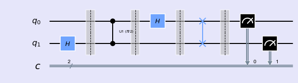
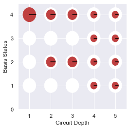
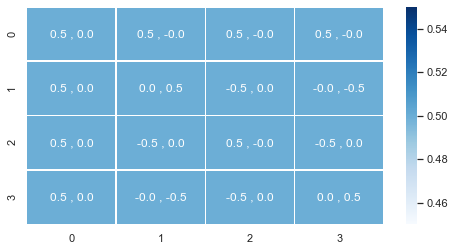
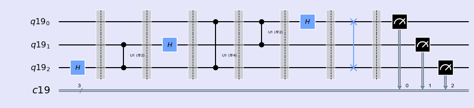
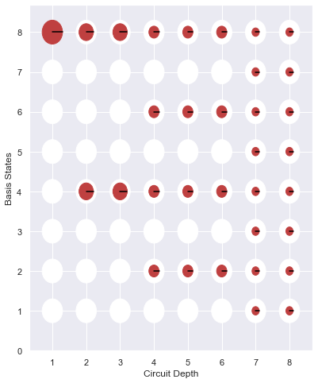

### Quantum Fourier Transform 

<div class="alert alert-block alert-info">
Bell state is constructed with application of $\textbf{Hadamard}$ and $\textbf{CNOT}$ gates in two qubit system.
</div>


```python
%matplotlib inline
import numpy as np
import IPython
import matplotlib.pyplot as plt
from qiskit import QuantumCircuit,ClassicalRegister,QuantumRegister
from qiskit import BasicAer
from qiskit.tools.jupyter import *
from qiskit.visualization import *
import seaborn as sns
sns.set()
```


```python
from helper import *
```

QFT is defined as

$$ QFT:|x> = \frac{1}{\sqrt{N}}\sum_{k=0}^{N-1} \omega_{x}^{k}|k>$$

where \\( \omega_{x}^{k} \\) is \\( N^{th} (N = 2^{n} \\) ) root of unity: \\( e^{\frac{2\pi i}{2^{n}}} \\).

$$ QFT: F_{N} =  \frac{1}{\sqrt{N}} \left( \begin{array}{cccccc}
    1  &         1   &        1       &     1          &   \cdots   &  1   \\\
    1  &  \omega_{n} & \omega_{n}^{2} & \omega_{n}^{3} &   \cdots   & \omega_{n} ^{N-1}\\\
    1  &  \omega_{n}^{2} & \omega_{n}^{4} & \omega_{n}^{6} &   \cdots   & \omega_{n} ^{2(N-1)}\\\
    1  &  \omega_{n}^{3} & \omega_{n}^{6} & \omega_{n}^{9} &   \cdots   & \omega_{n} ^{3(N-1)}\\\
   \vdots  & \vdots  & \vdots         & \vdots         &    \dots   & \vdots \\\
   1  &  \omega_{n}^{(N-1)} & \omega_{n}^{2(N-1)} & \omega_{n}^{3(N-1)} &   \cdots   & \omega_{n} ^{(N-1((N-1)}\\\
\end{array}\right )$$


#### QFT ( 1 qubit)


For single qubit circuit ( \\( n = 1, N = 2^{1} = 2)\\)


$$\omega_n = e^{\frac{2\pi i}{2^{n}}} = -1$$.


$$QFT_1 = \frac{1}{\sqrt{2}} \left( \begin{array}{cc}
    1  &   1 \\\
    1  &  -1\\\
\end{array}\right)$$
    
    
It is very simple, QFT in single qubit id just a Hadamate operation.


#### QFT (2 qubits)

For two qubit circuit, ( \\( n =2, N = 2^{2} = 4)\\)


$$ \omega_{n} = e^{\frac{2\pi i}{2^{n}}} = i$$

$$QFT_2 = \frac{1}{{2}}\left( \begin{array}{cc}
    1  &   1  &  1  &   1\\\
    1  &   i  &  -1  &  -i\\\
    1  &   -1  &  1  &   -1\\\
    1  &  -i  &  -1  &  i\\\
\end{array} \right) $$
 
Our task is to represent this matrix in terms of fundamental gate metrix.

- Circuit


```python
def qft2():
    qc = QuantumCircuit(2,2)
    qc.h(1)
    qc.barrier()
    qc.cu1(np.pi/2, 0, 1)
    qc.barrier()
    qc.h(0)
    qc.barrier()
    qc.swap(0,1)
    return qc
```


```python
qc = qft2()
drawCircuit_2q(qc)
```





- Phase


```python
def getPhaseSeq():
    phaseDic = []
    qc = QuantumCircuit(2,2)
    qc0 = qc.copy()
    qc.h(1)
    qc1 = qc.copy()
    qc.cu1(np.pi/2, 0, 1)
    qc2 = qc.copy()
    qc.h(0)
    qc3 = qc.copy()
    qc.swap(0,1)
    qc4 = qc.copy()
    for iqc in [qc0,qc1,qc2,qc3,qc4]:
        phaseDic.append(getPhase(iqc))
    return phaseDic    
```


```python
drawPhase(getPhaseSeq())
```





- State vector as tensor product

Since this circuit consists of pure superposition brought up by hadamard gate, it is possible to obtain final state vector by taking direct product of single qubit states. Results from operation of H gate on single qubit can be multiplied with direct product operation to get final state.
    
$$ \frac{1}{\sqrt{2}} (|0 \rangle + | 1\rangle) \otimes \frac{1}{\sqrt{2}}(|0 \rangle + | 1\rangle) = \frac{1}{2}(|00 \rangle + |01 \rangle + |10 \rangle + |11 \rangle $$
    

i.e., $$\frac{1}{\sqrt{2}}\left( \begin{array}{cc}
    1   \\\
    1 
\end{array} \right) \otimes \frac{1}{\sqrt{2}}\left( \begin{array}{cc}
    1   \\\
    1 
\end{array} \right)  = \frac{1}{2} \left( \begin{array}{cc}
    1   \\\
    1 \\\
    1 \\\
    1
\end{array} \right) $$

Where \\( |00 \rangle , |01 \rangle , |10 \rangle \\) and \\( |11 \rangle \\) are basis states for two qubit system.


- Matrix Element

- How to realize it the quantum circuit?


    
    
$$ I = \left( \begin{array}{cc}
    1  &   0 \\\
    0  &   1
\end{array} \right) ;H = \frac{1}{\sqrt{2}} \left( \begin{array}{cc}
    1  &   0 \\\
    0  &   1
\end{array} \right) ;$$

$$ C_{u1} =\left( \begin{array}{cc}
1 & 0 & 0 & 0\\\
0 & 1 & 0 & 0\\\
0 & 0 & 1 & 0\\\
0 & 0 & 0 & i
\end{array} \right) ; SWAP =\left( \begin{array}{cc}
1 & 0 & 0 & 0\\\
0 & 0 & 1 & 0\\\
0 & 1 & 0 & 0\\\
0 & 0 & 0 & 1
\end{array} \right) $$


At first barrier: \\( U_1 = I \otimes H \\)
    
At second barrier: \\( U_2 =  C _{u1} \times (I \otimes H) \\)
    
At third barrier: \\( U_3 = (H \otimes I) \times C _{u1} \times (I \otimes H) \\)    

At fourth barrier: \\( U_4 =  SWAP \times (H \otimes I) \times C _{u1} \times (I \otimes H) \\)     

Implementing Numpy


```python
I = np.eye(2,2)
H = 1/np.sqrt(2)*np.array([[1,1],[1,-1]])
H_kron_I = np.kron(H,I)
CU1 = np.array([[1,0,0,0],[0,1,0,0],[0,0,1,0],[0,0,0,0.+1.j]])
I_kron_H = np.kron(I,H)
SWAP = np.array([[1,0,0,0],[0,0,1,0],[0,1,0,0],[0,0,0,1]])
```


```python
U = np.dot(H_kron_I,np.dot(CU1,np.dot(I_kron_H,SWAP)))
U
```


    array([[ 0.5+0.j ,  0.5+0.j ,  0.5+0.j ,  0.5+0.j ],
           [ 0.5+0.j ,  0. +0.5j, -0.5+0.j ,  0. -0.5j],
           [ 0.5+0.j , -0.5+0.j ,  0.5+0.j , -0.5+0.j ],
           [ 0.5+0.j ,  0. -0.5j, -0.5+0.j ,  0. +0.5j]])


```python
ket = np.array([1,0,0,0])
np.dot(U,ket)
```


    array([0.5+0.j, 0.5+0.j, 0.5+0.j, 0.5+0.j])


```python
qc = qft2()
plotMatrix(qc)
```





#### QFT (3 qubits)

- Circuit Diagram


```python
def qft3():
    n = 3
    q = QuantumRegister(n)
    c = ClassicalRegister(n)
    qc = QuantumCircuit(q,c)
    qc.h(q[2])
    qc.barrier()
    qc.cu1(np.pi/2, q[1], q[2])
    qc.barrier()
    qc.h(q[1])
    qc.barrier()
    qc.cu1(np.pi/4, q[0], q[2])
    qc.barrier()
    qc.cu1(np.pi/2, q[0], q[1])
    qc.barrier()
    qc.h(q[0])
    qc.barrier()
    qc.swap(q[0], q[2])
    return q,c,qc
```


```python
q,c,qc = qft3()
qc.barrier()
qc.measure(q,c)
style = {'backgroundcolor': 'lavender'}
qc.draw(output='mpl', style = style)
```





- State vector


- Intermediate Ket and Phases


```python
def getPhaseSeq():
    phaseDic = []
    QC = []
    n = 3
    q = QuantumRegister(n)
    c = ClassicalRegister(n)
    qc = QuantumCircuit(q,c)
    qc0 = qc.copy()
    qc.h(q[2])
    qc1 = qc.copy()
    qc.cu1(np.pi/2, q[1], q[2])
    qc2 = qc.copy()
    qc.h(q[1])
    qc3 = qc.copy()
    qc.cu1(np.pi/4, q[0], q[2])
    qc4 = qc.copy()
    qc.cu1(np.pi/2, q[0], q[1])
    qc5 = qc.copy()
    qc.h(q[0])
    qc6 = qc.copy()
    qc.swap(q[0], q[2])
    qc7 = qc.copy()
    QC = [qc0,qc1,qc2,qc3,qc4,qc5,qc6,qc7]
    for iqc in QC:
        phaseDic.append(getPhase(iqc))
    return QC, phaseDic    
```


```python
drawPhase(phaseDic)
```





- Matrix Element


```python
q,c,qc = qft3()
plotMatrix(qc)
```


