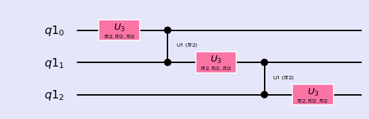

### Muti Qubits Circuits


```python
%matplotlib inline
import numpy as np
import IPython
import matplotlib.pyplot as plt
from qiskit import QuantumCircuit
from qiskit import BasicAer
from qiskit.tools.jupyter import *
from qiskit.visualization import *
import seaborn as sns
sns.set()
```


```python
from helper import *
import os
import glob
import moviepy.editor as mpy
from numpy import pi
```

--------

#### Controlled Phase Rotation


```python
qc = QuantumCircuit(2)
qc.cu1(np.pi/2,0, 1)
qc.draw(output='mpl')
style = {'backgroundcolor': 'lavender'}
qc.draw(output='mpl', style = style)
```


```python
getMatrix(qc)
```


    matrix([[1.+0.j, 0.+0.j, 0.+0.j, 0.+0.j],
            [0.+0.j, 1.+0.j, 0.+0.j, 0.+0.j],
            [0.+0.j, 0.+0.j, 1.+0.j, 0.+0.j],
            [0.+0.j, 0.+0.j, 0.+0.j, 0.+1.j]])


-------------------

#### U operator and control phase gate

$$ (I \otimes I \otimes U_3)  \times (I \otimes CU_1 ) \times (I \otimes U_3 \otimes I)  \times (CU_1 \otimes I) \times (U_3 \otimes I \otimes I)$$


```python
q = QuantumRegister(3)
qc = QuantumCircuit(q)

qc.u3(pi/2,pi/2,pi/2,q[0])
qc.cu1(pi/2,q[0], q[1])
qc.u3(pi/2,pi/2,pi/2,q[1])
qc.cu1(pi/2,q[1], q[2])
qc.u3(pi/2,pi/2,pi/2,q[2])

style = {'backgroundcolor': 'lavender'}
qc.draw(output='mpl', style = style)
```





```python
getMatrix(qc)
```


    matrix([[ 0.354+0.j   , -0.   -0.354j,  0.   -0.354j, -0.354+0.j   ,
              0.   -0.354j, -0.354+0.j   , -0.354+0.j   ,  0.   +0.354j],
            [ 0.   +0.354j, -0.354+0.j   ,  0.   +0.354j, -0.354+0.j   ,
              0.354+0.j   ,  0.   +0.354j,  0.354-0.j   ,  0.   +0.354j],
            [ 0.   +0.354j,  0.354+0.j   , -0.354+0.j   ,  0.   +0.354j,
              0.   +0.354j,  0.354-0.j   , -0.354+0.j   ,  0.   +0.354j],
            [-0.354+0.j   ,  0.   -0.354j,  0.354-0.j   ,  0.   +0.354j,
             -0.354+0.j   , -0.   -0.354j,  0.354-0.j   ,  0.   +0.354j],
            [ 0.   +0.354j,  0.354-0.j   ,  0.354-0.j   , -0.   -0.354j,
             -0.354+0.j   ,  0.   +0.354j,  0.   +0.354j,  0.354-0.j   ],
            [-0.354+0.j   , -0.   -0.354j, -0.354+0.j   , -0.   -0.354j,
              0.   -0.354j,  0.354+0.j   , -0.   -0.354j,  0.354-0.j   ],
            [-0.354+0.j   ,  0.   +0.354j, -0.   -0.354j, -0.354+0.j   ,
              0.354-0.j   , -0.   -0.354j,  0.   +0.354j,  0.354-0.j   ],
            [-0.   -0.354j,  0.354-0.j   ,  0.   +0.354j, -0.354+0.j   ,
              0.   +0.354j, -0.354+0.j   , -0.   -0.354j,  0.354-0.j   ]])


------------

#### All Gates together in 4-qubit circut


```python
q = QuantumRegister(4)
qc = QuantumCircuit(q)

qc.u3(pi/2,pi/2,pi/2,q[0])
qc.cu1(pi/2,q[0], q[1])
qc.u2(pi/2,pi/2,q[1])
qc.u1(pi/2,q[2])
qc.x(q[0])
qc.ccx(q[1],q[2],q[3])
qc.y(q[1])
qc.z(q[2])
qc.cx(q[2],q[3])
qc.z(q[3])
qc.h(q[3])
qc.s(q[0])
qc.cu1(pi/2,q[1], q[2])
qc.swap(q[0],q[2])
qc.cswap(q[0],q[1],q[3])

style = {'backgroundcolor': 'lavender'}
qc.draw(output='mpl', style = style)
```


```python
getMatrix(qc)
```


    matrix([[ 0.   +0.354j, -0.354+0.j   , -0.   -0.354j,  0.354-0.j   ,
              0.   +0.j   ,  0.   +0.j   ,  0.   +0.j   ,  0.   +0.j   ,
             -0.   -0.354j,  0.354-0.j   ,  0.   +0.354j, -0.354+0.j   ,
              0.   +0.j   ,  0.   +0.j   ,  0.   +0.j   ,  0.   +0.j   ],
            [ 0.   +0.j   ,  0.   +0.j   ,  0.   +0.j   ,  0.   +0.j   ,
              0.354-0.j   ,  0.   +0.354j, -0.354+0.j   , -0.   -0.354j,
              0.   +0.j   ,  0.   +0.j   ,  0.   +0.j   ,  0.   +0.j   ,
             -0.354+0.j   , -0.   -0.354j,  0.354-0.j   ,  0.   +0.354j],
            [-0.354+0.j   ,  0.   -0.354j, -0.354+0.j   , -0.   -0.354j,
              0.   +0.j   ,  0.   +0.j   ,  0.   +0.j   ,  0.   +0.j   ,
              0.354-0.j   ,  0.   +0.354j,  0.354-0.j   ,  0.   +0.354j,
              0.   +0.j   ,  0.   +0.j   ,  0.   +0.j   ,  0.   +0.j   ],
            [ 0.   +0.j   ,  0.   +0.j   ,  0.   +0.j   ,  0.   +0.j   ,
              0.354-0.j   ,  0.   +0.354j, -0.354+0.j   , -0.   -0.354j,
              0.   +0.j   ,  0.   +0.j   ,  0.   +0.j   ,  0.   +0.j   ,
              0.354-0.j   ,  0.   +0.354j, -0.354+0.j   , -0.   -0.354j],
            [ 0.   +0.354j,  0.354-0.j   , -0.354+0.j   ,  0.   +0.354j,
              0.   +0.j   ,  0.   +0.j   ,  0.   +0.j   ,  0.   +0.j   ,
             -0.   -0.354j, -0.354+0.j   ,  0.354-0.j   , -0.   -0.354j,
              0.   +0.j   ,  0.   +0.j   ,  0.   +0.j   ,  0.   +0.j   ],
            [ 0.   +0.j   ,  0.   +0.j   ,  0.   +0.j   ,  0.   +0.j   ,
              0.354-0.j   , -0.   -0.354j,  0.   +0.354j,  0.354-0.j   ,
              0.   +0.j   ,  0.   +0.j   ,  0.   +0.j   ,  0.   +0.j   ,
             -0.354+0.j   ,  0.   +0.354j, -0.   -0.354j, -0.354+0.j   ],
            [-0.354+0.j   ,  0.   +0.354j,  0.   +0.354j,  0.354-0.j   ,
              0.   +0.j   ,  0.   +0.j   ,  0.   +0.j   ,  0.   +0.j   ,
              0.354-0.j   , -0.   -0.354j, -0.   -0.354j, -0.354+0.j   ,
              0.   +0.j   ,  0.   +0.j   ,  0.   +0.j   ,  0.   +0.j   ],
            [ 0.   +0.j   ,  0.   +0.j   ,  0.   +0.j   ,  0.   +0.j   ,
              0.354-0.j   , -0.   -0.354j,  0.   +0.354j,  0.354-0.j   ,
              0.   +0.j   ,  0.   +0.j   ,  0.   +0.j   ,  0.   +0.j   ,
              0.354-0.j   , -0.   -0.354j,  0.   +0.354j,  0.354-0.j   ],
            [ 0.   +0.354j, -0.354+0.j   , -0.   -0.354j,  0.354-0.j   ,
              0.   +0.j   ,  0.   +0.j   ,  0.   +0.j   ,  0.   +0.j   ,
              0.   +0.354j, -0.354+0.j   , -0.   -0.354j,  0.354-0.j   ,
              0.   +0.j   ,  0.   +0.j   ,  0.   +0.j   ,  0.   +0.j   ],
            [ 0.   +0.j   ,  0.   +0.j   ,  0.   +0.j   ,  0.   +0.j   ,
              0.354-0.j   ,  0.   +0.354j,  0.354-0.j   ,  0.   +0.354j,
              0.   +0.j   ,  0.   +0.j   ,  0.   +0.j   ,  0.   +0.j   ,
             -0.354+0.j   , -0.   -0.354j, -0.354+0.j   , -0.   -0.354j],
            [-0.354+0.j   , -0.   -0.354j, -0.354+0.j   , -0.   -0.354j,
              0.   +0.j   ,  0.   +0.j   ,  0.   +0.j   ,  0.   +0.j   ,
             -0.354+0.j   , -0.   -0.354j, -0.354+0.j   , -0.   -0.354j,
              0.   +0.j   ,  0.   +0.j   ,  0.   +0.j   ,  0.   +0.j   ],
            [ 0.   +0.j   ,  0.   +0.j   ,  0.   +0.j   ,  0.   +0.j   ,
             -0.354+0.j   , -0.   -0.354j, -0.354+0.j   , -0.   -0.354j,
              0.   +0.j   ,  0.   +0.j   ,  0.   +0.j   ,  0.   +0.j   ,
             -0.354+0.j   , -0.   -0.354j, -0.354+0.j   , -0.   -0.354j],
            [ 0.   +0.354j,  0.354-0.j   , -0.354+0.j   ,  0.   +0.354j,
              0.   +0.j   ,  0.   +0.j   ,  0.   +0.j   ,  0.   +0.j   ,
              0.   +0.354j,  0.354-0.j   , -0.354+0.j   ,  0.   +0.354j,
              0.   +0.j   ,  0.   +0.j   ,  0.   +0.j   ,  0.   +0.j   ],
            [ 0.   +0.j   ,  0.   +0.j   ,  0.   +0.j   ,  0.   +0.j   ,
              0.354-0.j   , -0.   -0.354j, -0.   -0.354j, -0.354+0.j   ,
              0.   +0.j   ,  0.   +0.j   ,  0.   +0.j   ,  0.   +0.j   ,
             -0.354+0.j   ,  0.   +0.354j,  0.   +0.354j,  0.354-0.j   ],
            [-0.354+0.j   ,  0.   +0.354j,  0.   +0.354j,  0.354-0.j   ,
              0.   +0.j   ,  0.   +0.j   ,  0.   +0.j   ,  0.   +0.j   ,
             -0.354+0.j   ,  0.   +0.354j,  0.   +0.354j,  0.354-0.j   ,
              0.   +0.j   ,  0.   +0.j   ,  0.   +0.j   ,  0.   +0.j   ],
            [ 0.   +0.j   ,  0.   +0.j   ,  0.   +0.j   ,  0.   +0.j   ,
             -0.354+0.j   ,  0.   +0.354j,  0.   +0.354j,  0.354-0.j   ,
              0.   +0.j   ,  0.   +0.j   ,  0.   +0.j   ,  0.   +0.j   ,
             -0.354+0.j   ,  0.   +0.354j,  0.   +0.354j,  0.354-0.j   ]])


```python

```
