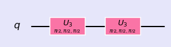

### Single Qubit Circuits


```python
%matplotlib inline
import numpy as np
import IPython
import matplotlib.pyplot as plt
from qiskit import QuantumCircuit
from qiskit import BasicAer
from qiskit.tools.jupyter import *
from qiskit.visualization import *
import seaborn as sns
sns.set()
```


```python
from helper import *
import os
import glob
import moviepy.editor as mpy
```


#### Single qubit circuit:

Base states : |0>, |1>


```python
qc = QuantumCircuit(1)
qc.u3(np.pi/2,np.pi/2,np.pi/2,0)

style = {'backgroundcolor': 'lavender'}
qc.draw(output='mpl', style = style)
```


```python
getMatrix(qc)
```


    matrix([[ 0.707+0.j   , -0.   -0.707j],
            [ 0.   +0.707j, -0.707+0.j   ]])


#### Gates in series


```python
qc = QuantumCircuit(1)
qc.u3(np.pi/2,np.pi/2,np.pi/2,0)
qc.u3(np.pi/2,np.pi/2,np.pi/2,0)
style = {'backgroundcolor': 'lavender'}
qc.draw(output='mpl', style = style)
```





```python
getMatrix(qc)
```


    matrix([[1.+0.j, 0.+0.j],
            [0.+0.j, 1.+0.j]])


----------
