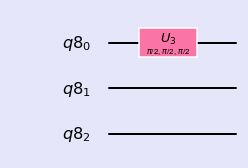
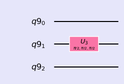
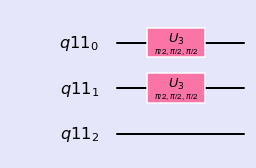
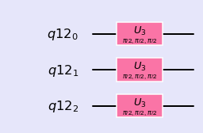
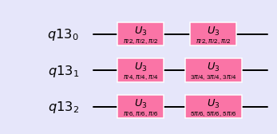

### Three Qubit Circuits


```python
%matplotlib inline
import numpy as np
import IPython
import matplotlib.pyplot as plt
from qiskit import QuantumCircuit
from qiskit import BasicAer
from qiskit.tools.jupyter import *
from qiskit.visualization import *
import seaborn as sns
sns.set()
```


```python
from helper import *
import os
import glob
import moviepy.editor as mpy
from numpy import pi
```


#### Three qubit circuit

Base states: |000>,|001>,|010>,|011>,|100>,|110>,|101>,|111>

#### Gate on First Qubit

\\( I \otimes I \otimes U \\)


```python
q = QuantumRegister(3)
qc = QuantumCircuit(q)
qc.u3(pi/2,pi/2,pi/2,q[0])

style = {'backgroundcolor': 'lavender'}
qc.draw(output='mpl', style = style)
```





```python
getMatrix(qc)
```


    matrix([[ 0.707+0.j   , -0.   -0.707j,  0.   +0.j   ,  0.   +0.j   ,
              0.   +0.j   ,  0.   +0.j   ,  0.   +0.j   ,  0.   +0.j   ],
            [ 0.   +0.707j, -0.707+0.j   ,  0.   +0.j   ,  0.   +0.j   ,
              0.   +0.j   ,  0.   +0.j   ,  0.   +0.j   ,  0.   +0.j   ],
            [ 0.   +0.j   ,  0.   +0.j   ,  0.707+0.j   , -0.   -0.707j,
              0.   +0.j   ,  0.   +0.j   ,  0.   +0.j   ,  0.   +0.j   ],
            [ 0.   +0.j   ,  0.   +0.j   ,  0.   +0.707j, -0.707+0.j   ,
              0.   +0.j   ,  0.   +0.j   ,  0.   +0.j   ,  0.   +0.j   ],
            [ 0.   +0.j   ,  0.   +0.j   ,  0.   +0.j   ,  0.   +0.j   ,
              0.707+0.j   , -0.   -0.707j,  0.   +0.j   ,  0.   +0.j   ],
            [ 0.   +0.j   ,  0.   +0.j   ,  0.   +0.j   ,  0.   +0.j   ,
              0.   +0.707j, -0.707+0.j   ,  0.   +0.j   ,  0.   +0.j   ],
            [ 0.   +0.j   ,  0.   +0.j   ,  0.   +0.j   ,  0.   +0.j   ,
              0.   +0.j   ,  0.   +0.j   ,  0.707+0.j   , -0.   -0.707j],
            [ 0.   +0.j   ,  0.   +0.j   ,  0.   +0.j   ,  0.   +0.j   ,
              0.   +0.j   ,  0.   +0.j   ,  0.   +0.707j, -0.707+0.j   ]])


#### Gate on Second Qubit

\\( I \otimes U \otimes I \\)


```python
q = QuantumRegister(3)
qc = QuantumCircuit(q)
qc.u3(pi/2,pi/2,pi/2,q[1])

style = {'backgroundcolor': 'lavender'}
qc.draw(output='mpl', style = style)
```





```python
getMatrix(qc)
```


    matrix([[ 0.707+0.j   ,  0.   +0.j   , -0.   -0.707j,  0.   +0.j   ,
              0.   +0.j   ,  0.   +0.j   ,  0.   +0.j   ,  0.   +0.j   ],
            [ 0.   +0.j   ,  0.707+0.j   ,  0.   +0.j   , -0.   -0.707j,
              0.   +0.j   ,  0.   +0.j   ,  0.   +0.j   ,  0.   +0.j   ],
            [ 0.   +0.707j,  0.   +0.j   , -0.707+0.j   ,  0.   +0.j   ,
              0.   +0.j   ,  0.   +0.j   ,  0.   +0.j   ,  0.   +0.j   ],
            [ 0.   +0.j   ,  0.   +0.707j,  0.   +0.j   , -0.707+0.j   ,
              0.   +0.j   ,  0.   +0.j   ,  0.   +0.j   ,  0.   +0.j   ],
            [ 0.   +0.j   ,  0.   +0.j   ,  0.   +0.j   ,  0.   +0.j   ,
              0.707+0.j   ,  0.   +0.j   , -0.   -0.707j,  0.   +0.j   ],
            [ 0.   +0.j   ,  0.   +0.j   ,  0.   +0.j   ,  0.   +0.j   ,
              0.   +0.j   ,  0.707+0.j   ,  0.   +0.j   , -0.   -0.707j],
            [ 0.   +0.j   ,  0.   +0.j   ,  0.   +0.j   ,  0.   +0.j   ,
              0.   +0.707j,  0.   +0.j   , -0.707+0.j   ,  0.   +0.j   ],
            [ 0.   +0.j   ,  0.   +0.j   ,  0.   +0.j   ,  0.   +0.j   ,
              0.   +0.j   ,  0.   +0.707j,  0.   +0.j   , -0.707+0.j   ]])


#### Gate on Third Qubit

$$U \otimes I \otimes I$$


```python
q = QuantumRegister(3)
qc = QuantumCircuit(q)
qc.u3(pi/2,pi/2,pi/2,q[2])

style = {'backgroundcolor': 'lavender'}
qc.draw(output='mpl', style = style)
```


```python
getMatrix(qc)
```


    matrix([[ 0.707+0.j   ,  0.   +0.j   ,  0.   +0.j   ,  0.   +0.j   ,
             -0.   -0.707j,  0.   +0.j   ,  0.   +0.j   ,  0.   +0.j   ],
            [ 0.   +0.j   ,  0.707+0.j   ,  0.   +0.j   ,  0.   +0.j   ,
              0.   +0.j   , -0.   -0.707j,  0.   +0.j   ,  0.   +0.j   ],
            [ 0.   +0.j   ,  0.   +0.j   ,  0.707+0.j   ,  0.   +0.j   ,
              0.   +0.j   ,  0.   +0.j   , -0.   -0.707j,  0.   +0.j   ],
            [ 0.   +0.j   ,  0.   +0.j   ,  0.   +0.j   ,  0.707+0.j   ,
              0.   +0.j   ,  0.   +0.j   ,  0.   +0.j   , -0.   -0.707j],
            [ 0.   +0.707j,  0.   +0.j   ,  0.   +0.j   ,  0.   +0.j   ,
             -0.707+0.j   ,  0.   +0.j   ,  0.   +0.j   ,  0.   +0.j   ],
            [ 0.   +0.j   ,  0.   +0.707j,  0.   +0.j   ,  0.   +0.j   ,
              0.   +0.j   , -0.707+0.j   ,  0.   +0.j   ,  0.   +0.j   ],
            [ 0.   +0.j   ,  0.   +0.j   ,  0.   +0.707j,  0.   +0.j   ,
              0.   +0.j   ,  0.   +0.j   , -0.707+0.j   ,  0.   +0.j   ],
            [ 0.   +0.j   ,  0.   +0.j   ,  0.   +0.j   ,  0.   +0.707j,
              0.   +0.j   ,  0.   +0.j   ,  0.   +0.j   , -0.707+0.j   ]])


#### Gates on first two qubits

$$I \otimes U \otimes U$$


```python
q = QuantumRegister(3)
qc = QuantumCircuit(q)
qc.u3(pi/2,pi/2,pi/2,q[0])
qc.u3(pi/2,pi/2,pi/2,q[1])

style = {'backgroundcolor': 'lavender'}
qc.draw(output='mpl', style = style)
```





```python
getMatrix(qc)
```


    matrix([[ 0.5+0.j , -0. -0.5j, -0. -0.5j, -0.5+0.j ,  0. +0.j ,
              0. +0.j ,  0. +0.j ,  0. +0.j ],
            [ 0. +0.5j, -0.5+0.j ,  0.5-0.j ,  0. +0.5j,  0. +0.j ,
              0. +0.j ,  0. +0.j ,  0. +0.j ],
            [ 0. +0.5j,  0.5-0.j , -0.5+0.j ,  0. +0.5j,  0. +0.j ,
              0. +0.j ,  0. +0.j ,  0. +0.j ],
            [-0.5+0.j , -0. -0.5j, -0. -0.5j,  0.5-0.j ,  0. +0.j ,
              0. +0.j ,  0. +0.j ,  0. +0.j ],
            [ 0. +0.j ,  0. +0.j ,  0. +0.j ,  0. +0.j ,  0.5+0.j ,
             -0. -0.5j, -0. -0.5j, -0.5+0.j ],
            [ 0. +0.j ,  0. +0.j ,  0. +0.j ,  0. +0.j ,  0. +0.5j,
             -0.5+0.j ,  0.5-0.j ,  0. +0.5j],
            [ 0. +0.j ,  0. +0.j ,  0. +0.j ,  0. +0.j ,  0. +0.5j,
              0.5-0.j , -0.5+0.j ,  0. +0.5j],
            [ 0. +0.j ,  0. +0.j ,  0. +0.j ,  0. +0.j , -0.5+0.j ,
             -0. -0.5j, -0. -0.5j,  0.5-0.j ]])


#### Gate on all 3 qubits

$$U \otimes U \otimes U$$


```python
q = QuantumRegister(3)
qc = QuantumCircuit(q)
qc.u3(pi/2,pi/2,pi/2,q[0])
qc.u3(pi/2,pi/2,pi/2,q[1])
qc.u3(pi/2,pi/2,pi/2,q[2])

style = {'backgroundcolor': 'lavender'}
qc.draw(output='mpl', style = style)
```





```python
getMatrix(qc)
```


    matrix([[ 0.354+0.j   , -0.   -0.354j, -0.   -0.354j, -0.354+0.j   ,
             -0.   -0.354j, -0.354+0.j   , -0.354+0.j   ,  0.   +0.354j],
            [ 0.   +0.354j, -0.354+0.j   ,  0.354-0.j   ,  0.   +0.354j,
              0.354-0.j   ,  0.   +0.354j, -0.   -0.354j,  0.354-0.j   ],
            [ 0.   +0.354j,  0.354-0.j   , -0.354+0.j   ,  0.   +0.354j,
              0.354-0.j   , -0.   -0.354j,  0.   +0.354j,  0.354-0.j   ],
            [-0.354+0.j   , -0.   -0.354j, -0.   -0.354j,  0.354-0.j   ,
              0.   +0.354j, -0.354+0.j   , -0.354+0.j   , -0.   -0.354j],
            [ 0.   +0.354j,  0.354-0.j   ,  0.354-0.j   , -0.   -0.354j,
             -0.354+0.j   ,  0.   +0.354j,  0.   +0.354j,  0.354-0.j   ],
            [-0.354+0.j   , -0.   -0.354j,  0.   +0.354j, -0.354+0.j   ,
             -0.   -0.354j,  0.354-0.j   , -0.354+0.j   , -0.   -0.354j],
            [-0.354+0.j   ,  0.   +0.354j, -0.   -0.354j, -0.354+0.j   ,
             -0.   -0.354j, -0.354+0.j   ,  0.354-0.j   , -0.   -0.354j],
            [-0.   -0.354j,  0.354-0.j   ,  0.354-0.j   ,  0.   +0.354j,
              0.354-0.j   ,  0.   +0.354j,  0.   +0.354j, -0.354+0.j   ]])


#### Gate on all qubits

$$(U \times U) \otimes (U \times U) \otimes (U \times U)$$


```python
q = QuantumRegister(3)
qc = QuantumCircuit(q)
qc.u3(pi/2,pi/2,pi/2,q[0])
qc.u3(pi/2,pi/2,pi/2,q[0])
qc.u3(pi/4,pi/4,pi/4,q[1])
qc.u3(3*pi/4,3*pi/4,3*pi/4,q[1])
qc.u3(pi/6,pi/6,pi/6,q[2])
qc.u3(5*pi/6,5*pi/6,5*pi/6,q[2])

style = {'backgroundcolor': 'lavender'}
qc.draw(output='mpl', style = style)
```





```python
getMatrix(qc)
```


    matrix([[ 0.354+0.j   ,  0.   +0.j   ,  0.25 +0.25j ,  0.   +0.j   ,
              0.53 +0.306j,  0.   +0.j   ,  0.158+0.592j,  0.   +0.j   ],
            [ 0.   +0.j   ,  0.354+0.j   ,  0.   +0.j   ,  0.25 +0.25j ,
              0.   +0.j   ,  0.53 +0.306j,  0.   +0.j   ,  0.158+0.592j],
            [-0.25 +0.25j ,  0.   +0.j   ,  0.354-0.j   ,  0.   +0.j   ,
             -0.592+0.158j,  0.   +0.j   ,  0.53 +0.306j,  0.   +0.j   ],
            [ 0.   +0.j   , -0.25 +0.25j ,  0.   +0.j   ,  0.354-0.j   ,
              0.   +0.j   , -0.592+0.158j,  0.   +0.j   ,  0.53 +0.306j],
            [-0.53 +0.306j,  0.   +0.j   , -0.592-0.158j,  0.   +0.j   ,
              0.354-0.j   ,  0.   +0.j   ,  0.25 +0.25j ,  0.   +0.j   ],
            [ 0.   +0.j   , -0.53 +0.306j,  0.   +0.j   , -0.592-0.158j,
              0.   +0.j   ,  0.354-0.j   ,  0.   +0.j   ,  0.25 +0.25j ],
            [ 0.158-0.592j,  0.   +0.j   , -0.53 +0.306j,  0.   +0.j   ,
             -0.25 +0.25j ,  0.   +0.j   ,  0.354-0.j   ,  0.   +0.j   ],
            [ 0.   +0.j   ,  0.158-0.592j,  0.   +0.j   , -0.53 +0.306j,
              0.   +0.j   , -0.25 +0.25j ,  0.   +0.j   ,  0.354-0.j   ]])


