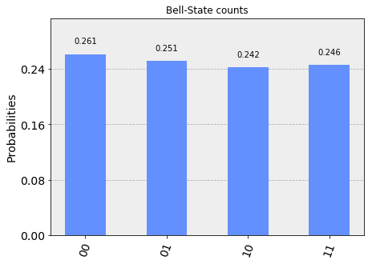
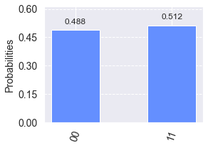
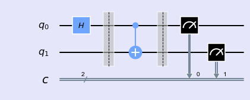
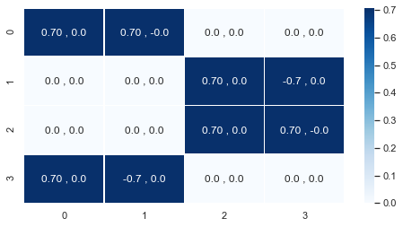

### Bell States


Bell state is constructed with application of \\(\textbf{Hadamard} \\) and \\(\textbf{CNOT}\\) gates in two qubit system.


```python
%matplotlib inline
import numpy as np
import IPython
import matplotlib.pyplot as plt
from qiskit import QuantumCircuit
from qiskit.tools.jupyter import *
from qiskit.visualization import *
import seaborn as sns
sns.set()
```


```python
from helper import *
```

#### Bell State Circuit 

 \\( \beta_{00} \\)


```python
def circuit_00():
    qc = QuantumCircuit(2,2)
    qc.h(0)
    qc.barrier()
    qc.cx(0, 1)
    return qc
```

- Circuit Diagram


```python
bell_00 = circuit_00()
drawCircuit(bell_00)
```


- Two qubit system (state vector)


    <ul>
        <li> Initial state = |00> </li>
        <li> After application of Hadamard Gate:  \\( \frac{1}{\sqrt{2}}|00\rangle + \frac{1}{\sqrt{2}}|01\rangle \\) </li>
        <li> After application of CNOT Gate: \\( \frac{1}{\sqrt{2}}|00 \rangle + \frac{1}{\sqrt{2}}|11 \rangle \\) </li>
    </ul>


```python
def getPhaseSeq():
    phaseDic = []
    qc0 = QuantumCircuit(2,2)
    qc1 = QuantumCircuit(2,2)
    qc1.h(0)
    qc2 = QuantumCircuit(2,2)
    qc2.h(0)
    qc2.cx(0, 1)
    for iqc in [qc0,qc1,qc2]:
        phaseDic.append(getPhase(iqc))
    return phaseDic    
```


```python
drawPhase(getPhaseSeq())
```





```python
bell_00 = circuit_00()
simCircuit(bell_00)
```





- Single qubit states (tensor product)


\\(\textbf{Question:}\\) Can you write Bell state as a tensor product of single qubit state?


\\( \textbf{Answer} \\): No, it is not possible. It is hard to realise.
    
  $$\left( \begin{array}{cc}
    p   \\\
    q 
\end{array} \right) \otimes \left( \begin{array}{cc}
    r   \\\
    s 
\end{array} \right)= c \left( \begin{array}{cc}
    m   \\\
    0 \\\
    0 \\\
    n
\end{array} \right) $$

- Matrix element (tensor product)


\\( \textbf{Question:}\\) Can we write matrix represented by the Bell circuit as a  tensor product of fundamental gate matrices?


```python
bell_00 = circuit_00()
drawCircuit(bell_00)
```





Based on above Bell circuit, lets construct the matrix representation of the circuit using fundamental gates matrices involved in the circuit.

$$H = \frac{1}{\sqrt{2}} \left( \begin{array}{cc}
    1  & 1 \\\
    1 & -1
\end{array} \right); I = \frac{1}{\sqrt{2}} \left( \begin{array}{cc}
    1  & 0 \\\
    0 &  1
\end{array} \right); \text{CNOT} = \left( \begin{array}{cccc} 
                              1 & 0 & 0 & 0 \\\
                              0 & 0 & 0 & 1 \\\
                              0 & 0 & 1 & 0 \\\
                              0 & 1 & 0 & 0 \\\
\end{array} \right)$$

- Before first barrier

$$ I \otimes H =  \left( \begin{array}{cc}
    H  & 0 \\\
    0 & H
\end{array} \right) $$

- After first barrier

\\( \text{CNOT} \\)

- Net operation before measurement

\\( U = \text{CNOT} \times (I \otimes H)   \\)
    


Lets express ``U`` matrix using ``numpy`` library.


```python
I = np.eye(2,2)
H = 1/np.sqrt(2)*np.array([[1,1],[1,-1]])
CNOT = np.array([[1,0,0,0],[0,0,0,1],[0,0,1,0],[0,1,0,0]])
I_kron_H = np.kron(I,H)
U = np.dot(CNOT,I_kron_H)
print(U)
```

    [[ 0.70710678  0.70710678  0.          0.        ]
     [ 0.          0.          0.70710678 -0.70710678]
     [ 0.          0.          0.70710678  0.70710678]
     [ 0.70710678 -0.70710678  0.          0.        ]]


We can also observe final ket vector by multiplying it with ```U``` matrix.


```python
ket_00 = np.array([1,0,0,0])
np.dot(U,ket_00)
```


    array([0.70710678, 0.        , 0.        , 0.70710678])


Infact we can check our matrix from our circuit shown below by implementing Q is kit's "unitary_simulator".


```python
bell_00 = circuit_00()
plotMatrix(bell_00)
```





-------
