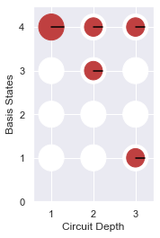

# Bell State

###### Latest python notebook is available [here](https://github.com/q4quanta/quantum-circuits)

The Bell states, a concept in quantum information science, are specific quantum states of two qubits that represent the simplest (and maximal) examples of quantum entanglement. The Bell states are a form of entangled and normalized basis vectors. This normalization implies that the overall probability of the particle being in one of the mentioned states is 1.[Wikipedia]

Import 'Qiskit' libraries

```python
%matplotlib inline
# Importing standard Qiskit libraries and configuring account
from qiskit import QuantumCircuit,QuantumRegister,ClassicalRegister, execute, Aer, IBMQ
from qiskit.compiler import transpile, assemble
from qiskit.tools.jupyter import *
from qiskit.visualization import *
```

--------

### Bell circuit

Design a Bell state circuit.

--------

```python
num_qubits = 2;
num_bits   = 2;
bell = QuantumCircuit(2,2)
bell.h(0)
bell.cx(0, 1)
bell.measure([0,1], [0,1])
bell.draw(output='mpl')
```


------------

###### Manual approach

- initial state = |00>
- After application of Hadamard Gate: \\( \frac{1}{\sqrt{2}}|00> + \frac{1}{\sqrt{2}}|10> \\)
- After application of CNOT Gate: \\( \frac{1}{\sqrt{2}}|00> + \frac{1}{\sqrt{2}}|11> \\)

------------

###### Simulation 

```python
simulator = Aer.get_backend('qasm_simulator')
result = execute(bell, simulator).result()
counts = result.get_counts(bell)
plot_histogram(counts, title='Bell-State counts')
```


-------------

### Extended Bell circuit -1


Extend the bell state circuit by adding one more Hadamard gate on second qubit and CNOT gate.

```python
num_qubits = 2;
num_bits   = 2;
bell = QuantumCircuit(2,2)
bell.h(0)
bell.cx(0, 1)
bell.h(1)
bell.cx(0, 1)
bell.measure([0,1], [0,1])
bell.draw(output='mpl')
```


------------

######  Manual approach:

 - Initial state = |00>
 - After application of Hadamard Gate: \\( \frac{1}{\sqrt{2}}|00> + \frac{1}{\sqrt{2}}|10> \\)
 - After application of CNOT Gate: \\( \frac{1}{\sqrt{2}}|00> + \frac{1}{\sqrt{2}}|11> \\)
 - After application of Hadamard Gate: 
\\( \frac{1}{2}|00> + \frac{1}{2}|01> + \frac{1}{2}|10> - \frac{1}{2}|11> \\)
 - After application of CNOT Gate: 
\\( \frac{1}{2}|00> + \frac{1}{2}|01> + \frac{1}{2}|11> - \frac{1}{2}|10> \\)

--------------

###### Simulation 

```
simulator = Aer.get_backend('qasm_simulator')
result = execute(bell, simulator).result()
counts = result.get_counts(bell)
plot_histogram(counts, title='Bell-State counts')
```




----------

### Extended Bell circuit - 2 

Extend the bell state circuit by adding two more Hadamard gates and two CNOT gates with three qubits.

-----------

```python
n =3
q = QuantumRegister(n)
c = ClassicalRegister(n)
circ = QuantumCircuit(q,c)
circ.h(q[0])
circ.cx(q[0], q[1])
circ.h(q[1])
circ.cx(q[1], q[2])
circ.h(q[2])
circ.measure(q,c)
# Change the background color in mpl
style = {'backgroundcolor': 'lightgreen'}
circ.draw(output='mpl', style = style)
```


----------------

###### Manual approach


- Initial state: |000>
- After Hadamard Gate : \\( \frac{1}{\sqrt{2}}|000> + \frac{1}{\sqrt{2}}|100> \\)
- After CNOT Gate : \\( \frac{1}{\sqrt{2}}|000> + \frac{1}{\sqrt{2}}|110> \\)
- After Hadamard Gate :\\( \frac{1}{{2}}|000> + \frac{1}{{2}}|010>  +  \frac{1}{{2}}|100> - \frac{1}{{2}}|110>\\) 
- After CNOT Gate :\\( \frac{1}{{2}}|000> + \frac{1}{{2}}|011>  +  \frac{1}{{2}}|100> - \frac{1}{{2}}|111>\\) 
- After Hadamard Gate :\\( \frac{1}{2\sqrt{2}}( |000> + |001> + |010>  - |011> +  |100> + |101>  - |110> + |111>) \\)

------------

###### Simulation 

```python
simulator = Aer.get_backend('qasm_simulator')
result = execute(circ, simulator).result()
counts = result.get_counts(circ)
plot_histogram(counts, title='Bell-State counts')
```


-------------------

### Reference
1. https://www.quantum-inspire.com/kbase/hadamard/
