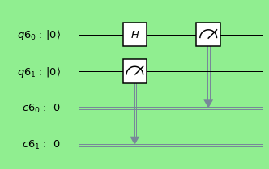
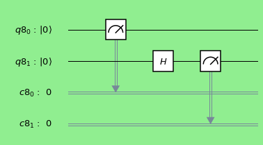
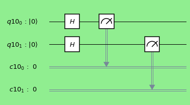
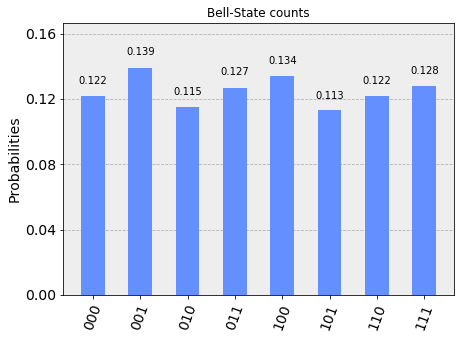
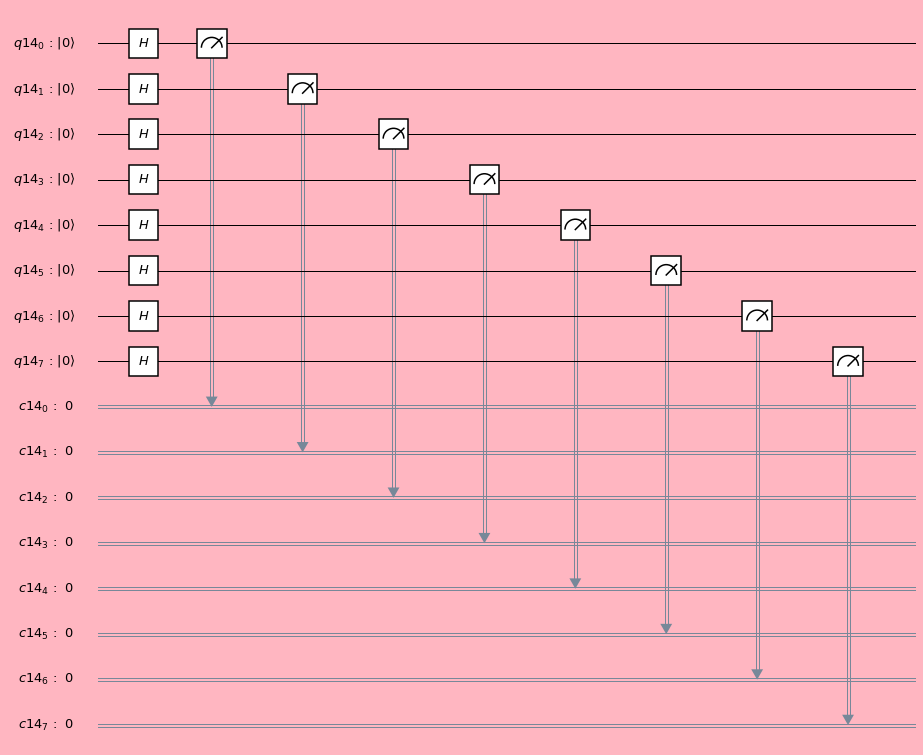

# Hadamard Gate and Circuits

Hadamard gate is single qubit operator. This transforms |0> state to a superposed state \\(\frac{1}{\sqrt{2}}|0> + \frac{1}{\sqrt{2}}|1>\\) and stae|1> to a superposed state \\(\frac{1}{\sqrt{2}}|0> - \frac{1}{\sqrt{2}}|1>\\). This gate is very important gate to construct Bell state, Quantum Fourier Transform (QFT) and many more.

------------

Import python library to perform computation in 'Qiskit' environment.

```python
%matplotlib inline
# Importing standard Qiskit libraries and configuring account
from qiskit import QuantumCircuit, QuantumRegister,ClassicalRegister
from qiskit import  execute, Aer, IBMQ
from qiskit.compiler import transpile, assemble
from qiskit.tools.jupyter import *
from qiskit.visualization import *
from qiskit.providers.aer import UnitarySimulator
```
---------

### Hadamard Gate (1 qubit)

Design the single Hadamard gate quantum circuit.

```python
n =1
q = QuantumRegister(n)
c = ClassicalRegister(n)
circ = QuantumCircuit(q,c)
circ.h(q[0])
circ.measure(q,c)

# Change the background color in mpl
style = {'backgroundcolor': 'lightgreen'}
circ.draw(output='mpl', style = style)
```


---------

######   Manual approach:

- Initial state: |0>
- After Hadamard Gate: \\(\frac{1}{\sqrt{2}}|0> + \frac{1}{\sqrt{2}}|1>\\)

--------------

######  Algebra:

 $$ H = \frac{1}{\sqrt{2}} \begin{bmatrix}
    1  & 1 \\\
    1 & -1
\end{bmatrix}; |1 > = \begin{bmatrix}
    1  \\\
    0
\end{bmatrix} ; |0> = \begin{bmatrix}
    0\\\
    1
\end{bmatrix}$$

-----------

######  Simulation


```python
simulator = Aer.get_backend('qasm_simulator')
result = execute(circ, simulator).result()
counts = result.get_counts(circ)
plot_histogram(counts, title='Bell-State counts')
```


-----------

###### Unitary representation


```python
n =1
q = QuantumRegister(n)
c = ClassicalRegister(n)
circ = QuantumCircuit(q,c)
circ.h(q[0])
# Select the UnitarySimulator from the Aer provider
simulator = Aer.get_backend('unitary_simulator')
# Execute and get counts
result = execute(circ, simulator).result()
unitary = result.get_unitary(circ)
print( unitary)

```

-------------

    [[ 0.70710678+0.j  0.70710678+0.j]
     [ 0.70710678+0.j -0.70710678+0.j]]

------------


### Hadamard Gate (2 qubits)

Lets perform three different configurations of quantum circuit with two qubits and Hadamard gates.

####  Type -I : Hadamard gate on first qubit

$$I \otimes H  =  \begin{bmatrix}
    1  &   0 \\\
    0  &   1
\end{bmatrix} \otimes \frac{1}{\sqrt{2}} \begin{bmatrix}
    1  &   1 \\\
    1  &  -1
\end{bmatrix}  = \frac{1}{\sqrt{2}}\begin{bmatrix}
1 & 1 & 0 & 0\\\
1 & -1 & 0 & 0\\\
0 & 0 & 1 & 1 \\\
0 & 0 & 1 & -1
\end{bmatrix} $$

---------

Design circuit with two qubit with Hadamard on first qubit and perform the measurement.

```python
n =2
q = QuantumRegister(n)
c = ClassicalRegister(n)
circ = QuantumCircuit(q,c)
circ.h(q[0])
circ.measure(q,c)

# Change the background color in mpl
style = {'backgroundcolor': 'lightgreen'}
circ.draw(output='mpl', style = style)
```





--------------------

######  Unitary representation 

```python
n =2
q = QuantumRegister(n)
c = ClassicalRegister(n)
circ = QuantumCircuit(q,c)
circ.h(q[0])
# Select the UnitarySimulator from the Aer provider
simulator = Aer.get_backend('unitary_simulator')
# Execute and get counts
result = execute(circ, simulator).result()
unitary = result.get_unitary(circ)
print( unitary)
```

------------

    [[ 0.70710678+0.j  0.70710678+0.j  0.        +0.j  0.        +0.j]
     [ 0.70710678+0.j -0.70710678+0.j  0.        +0.j  0.        +0.j]
     [ 0.        +0.j  0.        +0.j  0.70710678+0.j  0.70710678+0.j]
     [ 0.        +0.j  0.        +0.j  0.70710678+0.j -0.70710678+0.j]]


----------

####  Type -II : Hadamard on second qubit


$$ H \otimes I  = \frac{1}{\sqrt{2}} \begin{bmatrix}
    1  &   1 \\\
    1  &  -1
\end{bmatrix} \otimes \begin{bmatrix}
    1  &   0 \\\
    0  &   1
\end{bmatrix}  = \frac{1}{\sqrt{2}}\begin{bmatrix}
1 & 0 & 1 & 0\\\
0 & 1 & 0 & 1\\\
1 & 0 & -1 & 0 \\\
0 & 1 & 0 & -1
\end{bmatrix} $$

--------------


Design a quantum circuit with two qubits and Hadamard gate on first qubit. Perform the measurement.

```python
n =2
q = QuantumRegister(n)
c = ClassicalRegister(n)
circ = QuantumCircuit(q,c)
circ.h(q[1])
circ.measure(q,c)

# Change the background color in mpl
style = {'backgroundcolor': 'lightgreen'}
circ.draw(output='mpl', style = style)
```



----------------

######  Unitary representation 


```python
n =2
q = QuantumRegister(n)
c = ClassicalRegister(n)
circ = QuantumCircuit(q,c)
circ.h(q[1])
# Select the UnitarySimulator from the Aer provider
simulator = Aer.get_backend('unitary_simulator')
# Execute and get counts
result = execute(circ, simulator).result()
unitary = result.get_unitary(circ)
print( unitary)
```

    [[ 0.70710678+0.j  0.        +0.j  0.70710678+0.j  0.        +0.j]
     [ 0.        +0.j  0.70710678+0.j  0.        +0.j  0.70710678+0.j]
     [ 0.70710678+0.j  0.        +0.j -0.70710678+0.j  0.        +0.j]
     [ 0.        +0.j  0.70710678+0.j  0.        +0.j -0.70710678+0.j]]


----------

####  Type -III : Hadamard gate on both qubits

 $$ H_1 \otimes H_1 = \frac{1}{\sqrt{2}}\begin{bmatrix}
    1  &  1 \\\
    1  & -1
\end{bmatrix} \otimes \frac{1}{\sqrt{2}}\begin{bmatrix}
    1  &  1 \\\
    1  & -1
\end{bmatrix} = \frac{1}{2} \begin{bmatrix}
    1  &  1  &  1  &  1 \\\
    1  &  -1  &  1  &  -1 \\\
    1  &  1  &  -1  &  -1 \\\
    1  &  -1  &  -1  &  1 \\\
\end{bmatrix}$$

--------------

Design the quantum circuit with two Hadamard gates and perform measurement.

```python
n =2
q = QuantumRegister(n)
c = ClassicalRegister(n)
circ = QuantumCircuit(q,c)
circ.h(q[0])
circ.h(q[1])
circ.measure(q,c)

# Change the background color in mpl
style = {'backgroundcolor': 'lightgreen'}
circ.draw(output='mpl', style = style)
```



--------------

######  Manual approach

- Initial state: |00>
- After Hadamard Gate: \\(\frac{1}{\sqrt{2}}|00> + \frac{1}{\sqrt{2}}|10>\\)
- After Hadamard Gate: \\(\frac{1}{{2}}|00> + \frac{1}{{2}}|01>  +  \frac{1}{{2}}|10> + \frac{1}{{2}}|11>\\)
- This is tensor product of two Hadamard transform:
\\(H|0>_A \otimes H|0>_B\\)
-  i.e., \\((\frac{1}{\sqrt{2}}|0> + \frac{1}{\sqrt{2}}|1>) \otimes (\frac{1}{\sqrt{2}}|0> + \frac{1}{\sqrt{2}}|1>) = \frac{1}{{2}}|00> + \frac{1}{{2}}|01>  +  \frac{1}{{2}}|10> + \frac{1}{{2}}|11> \\)


-------------

######  Tensor Algebra:


- H operator in product space, \\(H_2 = H_1 \otimes H_1\\) :

$$\frac{1}{\sqrt{2}}\begin{bmatrix}
    1  &  1 \\\
    1  & -1
\end{bmatrix} \otimes \frac{1}{\sqrt{2}}\begin{bmatrix}
    1  &  1 \\\
    1  & -1
\end{bmatrix} = \frac{1}{2} \begin{bmatrix}
    1  &  1  &  1  &  1 \\\
    1  &  -1  &  1  &  -1 \\\
    1  &  1  &  -1  &  -1 \\\
    1  &  -1  &  -1  &  1 \\\
\end{bmatrix}$$

- Basis States in product space, \\(|q_1q_2> = q_1 \otimes q_2\\) : 

$$|00> = \begin{bmatrix}
    1  \\\
    0 \\\
    0\\\
    0
\end{bmatrix} ; |01> = \begin{bmatrix}
    0\\\
    1\\\
    0\\\
    0
\end{bmatrix} ; |10> = \begin{bmatrix}
    0  \\\
    0 \\\
    1\\\
    0
\end{bmatrix} ; |11> = \begin{bmatrix}
    0\\\
    0\\\
    0\\\
    1
\end{bmatrix}$$

-------------

- Linear transformation in product space:

Above transformation can be represented as :

$$H_2|00> = \frac{1}{{2}}|00> + \frac{1}{{2}}|01>  +  \frac{1}{{2}}|10> + \frac{1}{{2}}|11>$$

With above basis vector, a state \\( \frac{1}{{2}}|00> + \frac{1}{{2}}|01>  +  \frac{1}{{2}}|10> + \frac{1}{{2}}|11>\\) can be expressed as: 
$$\begin{bmatrix}
    \frac{1}{2} \\\
    \frac{1}{2} \\\
    \frac{1}{2}\\\
    \frac{1}{2}
\end{bmatrix}$$

Thus in Matrix Form:

$$ H_2|00>  = \frac{1}{2} \begin{bmatrix}
    1  &  1  &  1  &  1 \\\
    1  &  -1  &  1  &  -1 \\\
    1  &  1  &  -1  &  -1 \\\
    1  &  -1  &  -1  &  1 \\\
\end{bmatrix}\begin{bmatrix}  
    1  \\\
    0 \\\
    0\\\
    0
    \end{bmatrix}
    = \begin{bmatrix}
    \frac{1}{2} \\\
    \frac{1}{2} \\\
    \frac{1}{2}\\\
    \frac{1}{2}
\end{bmatrix}$$

$$=  \frac{1}{{2}}|00> + \frac{1}{{2}}|01>  +  \frac{1}{{2}}|10> + \frac{1}{{2}}|11> $$

--------

###### Tensor product of linear map:


The tensor product also operates on linear maps between vector spaces. Specifically, given two linear maps \\(𝑆:𝑉→𝑋\\) and \\(𝑇:𝑊→𝑌\\) between vector spaces, the tensor product of the two linear maps 𝑆 and 𝑇 is a linear map

 \\((𝑆 \otimes 𝑇)(v \otimes w) = 𝑆(v) \otimes 𝑇(w) \\).

-----------


######   Simulation


```python
simulator = Aer.get_backend('qasm_simulator')
result = execute(circ, simulator).result()
counts = result.get_counts(circ)
plot_histogram(counts, title='Bell-State counts')
```


--------------------


######  Unitary representation


```python
n =2
q = QuantumRegister(n)
c = ClassicalRegister(n)
circ = QuantumCircuit(q,c)
circ.h(q[0])
circ.h(q[1])
# Select the UnitarySimulator from the Aer provider
simulator = Aer.get_backend('unitary_simulator')
# Execute and get counts
result = execute(circ, simulator).result()
unitary = result.get_unitary(circ)
print( unitary)
```

-----------


    [[ 0.5+0.j  0.5+0.j  0.5+0.j  0.5+0.j]
     [ 0.5+0.j -0.5+0.j  0.5+0.j -0.5+0.j]
     [ 0.5+0.j  0.5+0.j -0.5+0.j -0.5+0.j]
     [ 0.5+0.j -0.5+0.j -0.5+0.j  0.5+0.j]]


-----------


### Multiple Hadamard gates (3 qubits)


Desigh the quantum circuit and perform measurement 

```python
n = 3
q = QuantumRegister(n)
c = ClassicalRegister(n)
circ = QuantumCircuit(q,c)
circ.h(q[0])
circ.h(q[1])
circ.h(q[2])
circ.measure(q,c)

# Change the background color in mpl
style = {'backgroundcolor': 'lightgreen'}
circ.draw(output='mpl', style = style)
```


-----------------------

######  Manual approach

- Initial state: |000>
- After Hadamard gate on first qubit: \\( \frac{1}{\sqrt{2}}|000> + \frac{1}{\sqrt{2}}|100> \\)
- After Hadamard gate on second qubit: \\(\frac{1}{{2}}|000> + \frac{1}{{2}}|010>  +  \frac{1}{{2}}|100> + \frac{1}{{2}}|110>\\)
- After Hadamard gate on third qubit: \\( \frac{1}{2\sqrt{2}}(|000>  + |001> + |010> + |011>  +  |100> +  |101> + |110> + |111>) \\)

which is equivalent to 

\\((\frac{1}{\sqrt{2}}|0> + \frac{1}{\sqrt{2}}|1>) \otimes (\frac{1}{\sqrt{2}}|0> + \frac{1}{\sqrt{2}}|1>) \otimes (\frac{1}{\sqrt{2}}|0> + \frac{1}{\sqrt{2}}|1>) \\)

------------

######  Tensor Algebra: 


- H operator in product space: \\( H_3 = H_1 \otimes H_1 \otimes H_1  = H_2 \otimes H_1\\):

$$ \frac{1}{\sqrt{2}}\begin{bmatrix}
    1  &  1 \\\
    1  & -1
\end{bmatrix} \otimes \frac{1}{\sqrt{2}}\begin{bmatrix}
    1  &  1 \\\
    1  & -1
\end{bmatrix} \otimes \frac{1}{\sqrt{2}}\begin{bmatrix}
    1  &  1 \\\
    1  & -1
\end{bmatrix}  = \frac{1}{2} \begin{bmatrix}
    1  &  1  &  1  &  1 \\\
    1  &  -1  &  1  &  -1 \\\
    1  &  1  &  -1  &  -1 \\\
    1  &  -1  &  -1  &  1 \\\
\end{bmatrix} \otimes \frac{1}{\sqrt{2}}\begin{bmatrix}
    1  &  1 \\\
    1  & -1
\end{bmatrix}$$

$$ = \frac{1}{2\sqrt{2}} \begin{bmatrix}
    1  &   1  &  1  &   1  &  1  &   1  &  1  &   1 \\\
    1  &  -1  &  1  &  -1  &  1  &  -1  &  1  &  -1 \\\
    1  &   1  & -1  &  -1  &  1  &   1  & -1  &  -1 \\\
    1  &  -1  & -1  &   1  &  1  &  -1  & -1  &   1 \\\
    1  &   1  &  1  &   1  &  -1  & -1  &  -1  & -1 \\\
    1  &  -1  &  1  &  -1  &  -1  &  1  &  -1  &  1 \\\
    1  &   1  & -1  &  -1  &  -1  &   -1  &  1  &   1 \\\
    1  &  -1  & -1  &   1  &  -1  &    1  &  1  &  -1 \\\
\end{bmatrix}$$


- Basis states in product space: \\( |q_1q_2q_3> = q_1 \otimes q_2 \otimes q_3\\) : 
    
$$ |000> = \begin{bmatrix}
    1  \\\
    0 \\\
    0\\\
    0\\\
    0\\\
    0\\\
    0\\\
    0\\\
\end{bmatrix} ; |001> = \begin{bmatrix}
    0\\\
    1\\\
    0\\\
    0\\\
    0\\\
    0\\\
    0\\\
    0
\end{bmatrix}; |010> = \begin{bmatrix}
    0\\\
    0\\\
    1\\\
    0\\\
    0\\\
    0\\\
    0\\\
    0
\end{bmatrix}; |011> = \begin{bmatrix}
    0\\\
    0\\\
    0\\\
    1\\\
    0\\\
    0\\\
    0\\\
    0
\end{bmatrix}; |100> = \begin{bmatrix}
    0\\\
    0\\\
    0\\\
    0\\\
    1\\\
    0\\\
    0\\\
    0
\end{bmatrix}$$

$$ |101> = \begin{bmatrix}
    0\\\
    0\\\
    0\\\
    0\\\
    0\\\
    1\\\
    0\\\
    0
\end{bmatrix}; |110> = \begin{bmatrix}
    0\\\
    0\\\
    0\\\
    0\\\
    0\\\
    0\\\
    1\\\
    0
\end{bmatrix}; |111> = \begin{bmatrix}
    0\\\
    0\\\
    0\\\
    0\\\
    0\\\
    0\\\
    0\\\
    1
\end{bmatrix}$$

-----------

- Above transformation can be represented as : \\( H_3|000> = \frac{1}{2\sqrt{2}}(|000>  + |001> + |010> + |011>  +  |100> +  |101> + |110> +|111>)\\). With above basis vector this quantum state can be expressed as:

$$\begin{bmatrix}
    \frac{1}{2\sqrt{2}} \\\
    \frac{1}{2\sqrt{2}} \\\
    \frac{1}{2\sqrt{2}}\\\
    \frac{1}{2\sqrt{2}}\\\
    \frac{1}{2\sqrt{2}} \\\
    \frac{1}{2\sqrt{2}} \\\
    \frac{1}{2\sqrt{2}}\\\
    \frac{1}{2\sqrt{2}}
\end{bmatrix}$$

Thus in Matrix Form:

$$ H_3|000> = \frac{1}{2\sqrt{2}} \begin{bmatrix}
    1  &   1  &  1  &   1  &  1  &   1  &  1  &   1 \\\
    1  &  -1  &  1  &  -1  &  1  &  -1  &  1  &  -1 \\\
    1  &   1  & -1  &  -1  &  1  &   1  & -1  &  -1 \\\
    1  &  -1  & -1  &   1  &  1  &  -1  & -1  &   1 \\\
    1  &   1  &  1  &   1  &  -1  & -1  &  -1  & -1 \\\
    1  &  -1  &  1  &  -1  &  -1  &  1  &  -1  &  1 \\\
    1  &   1  & -1  &  -1  &  -1  &   -1  &  1  &   1 \\\
    1  &  -1  & -1  &   1  &  -1  &    1  &  1  &  -1 \\\
\end{bmatrix} \begin{bmatrix}  
    1  \\\
    0 \\\
    0\\\
    0\\\
    0\\\
    0\\\
    0\\\
    0
    \end{bmatrix}
    = \begin{bmatrix}
    \frac{1}{2\sqrt{2}} \\\
    \frac{1}{2\sqrt{2}} \\\
    \frac{1}{2\sqrt{2}}\\\
    \frac{1}{2\sqrt{2}}\\\
    \frac{1}{2\sqrt{2}} \\\
    \frac{1}{2\sqrt{2}} \\\
    \frac{1}{2\sqrt{2}}\\\
    \frac{1}{2\sqrt{2}}
\end{bmatrix} $$

$$ = \frac{1}{2\sqrt{2}}(|000>  + |001> + |010> + |011>  +  |100> +  |101> + |110> +|111>)$$

------------

######  Simulation 


```python
simulator = Aer.get_backend('qasm_simulator')
result = execute(circ, simulator).result()
counts = result.get_counts(circ)
plot_histogram(counts, title='Bell-State counts')
```




----------------

######   Unitary representation 


```python
n =3
q = QuantumRegister(n)
c = ClassicalRegister(n)
circ = QuantumCircuit(q,c)
circ.h(q[0])
circ.h(q[1])
circ.h(q[2])
# Select the UnitarySimulator from the Aer provider
simulator = Aer.get_backend('unitary_simulator')
# Execute and get counts
result = execute(circ, simulator).result()
unitary = result.get_unitary(circ)
print( unitary)
```

---------------------

    [[ 0.35355339+0.j  0.35355339+0.j  0.35355339+0.j  0.35355339+0.j
       0.35355339+0.j  0.35355339+0.j  0.35355339+0.j  0.35355339+0.j]
     [ 0.35355339+0.j -0.35355339+0.j  0.35355339+0.j -0.35355339+0.j
       0.35355339+0.j -0.35355339+0.j  0.35355339+0.j -0.35355339+0.j]
     [ 0.35355339+0.j  0.35355339+0.j -0.35355339+0.j -0.35355339+0.j
       0.35355339+0.j  0.35355339+0.j -0.35355339+0.j -0.35355339+0.j]
     [ 0.35355339+0.j -0.35355339+0.j -0.35355339+0.j  0.35355339+0.j
       0.35355339+0.j -0.35355339+0.j -0.35355339+0.j  0.35355339+0.j]
     [ 0.35355339+0.j  0.35355339+0.j  0.35355339+0.j  0.35355339+0.j
      -0.35355339+0.j -0.35355339+0.j -0.35355339+0.j -0.35355339+0.j]
     [ 0.35355339+0.j -0.35355339+0.j  0.35355339+0.j -0.35355339+0.j
      -0.35355339+0.j  0.35355339+0.j -0.35355339+0.j  0.35355339+0.j]
     [ 0.35355339+0.j  0.35355339+0.j -0.35355339+0.j -0.35355339+0.j
      -0.35355339+0.j -0.35355339+0.j  0.35355339+0.j  0.35355339+0.j]
     [ 0.35355339+0.j -0.35355339+0.j -0.35355339+0.j  0.35355339+0.j
      -0.35355339+0.j  0.35355339+0.j  0.35355339+0.j -0.35355339+0.j]]


-----------


### Multiple Hadamard gates (8 Qubits)

###### Quantum Circuit

```python
n = 8
q = QuantumRegister(n)
c = ClassicalRegister(n)
circ = QuantumCircuit(q,c)
for k in range(8):
    circ.h(q[k])
    
circ.measure(q,c)

# Change the background color in mpl
style = {'backgroundcolor': 'lightpink'}
circ.draw(output='mpl', style = style)
```




--------------

######  Simulation

```python
simulator = Aer.get_backend('qasm_simulator')
result = execute(circ, simulator).result()
counts = result.get_counts(circ)
plot_histogram(counts, title='Bell-State counts')
```


------------

######   Unitary representation 


```python
n =8
q = QuantumRegister(n)
c = ClassicalRegister(n)
circ = QuantumCircuit(q,c)

for k in range(8):
    circ.h(q[k])
    
# Select the UnitarySimulator from the Aer provider
simulator = Aer.get_backend('unitary_simulator')
# Execute and get counts
result = execute(circ, simulator).result()
unitary = result.get_unitary(circ)
print( unitary)
```

----------


    [[ 0.0625+0.j  0.0625+0.j  0.0625+0.j ...  0.0625+0.j  0.0625+0.j
       0.0625+0.j]
     [ 0.0625+0.j -0.0625+0.j  0.0625+0.j ... -0.0625+0.j  0.0625+0.j
      -0.0625+0.j]
     [ 0.0625+0.j  0.0625+0.j -0.0625+0.j ...  0.0625+0.j -0.0625+0.j
      -0.0625+0.j]
     ...
     [ 0.0625+0.j -0.0625+0.j  0.0625+0.j ... -0.0625+0.j  0.0625+0.j
      -0.0625+0.j]
     [ 0.0625+0.j  0.0625+0.j -0.0625+0.j ...  0.0625+0.j -0.0625+0.j
      -0.0625+0.j]
     [ 0.0625+0.j -0.0625+0.j -0.0625+0.j ... -0.0625+0.j -0.0625+0.j
       0.0625+0.j]]


---------------

```python
unitary.shape
```

    (256, 256)


The End


```python

```

#### Reference:
1. https://quantumcomputing.stackexchange.com/questions/2270/how-to-input-2-qubits-in-2-hadamard-gates
