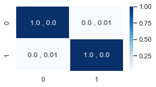
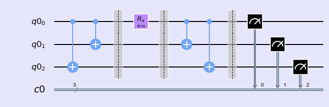
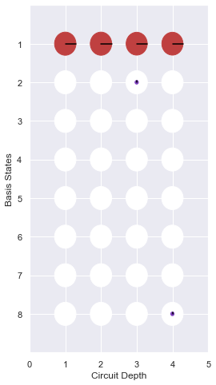
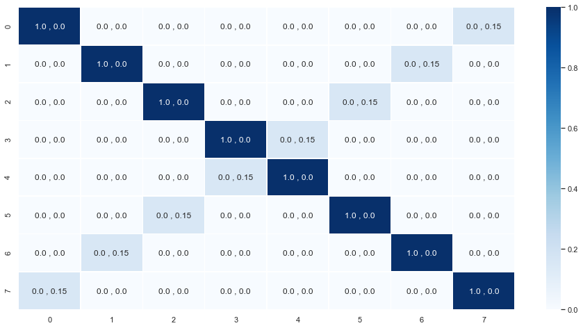
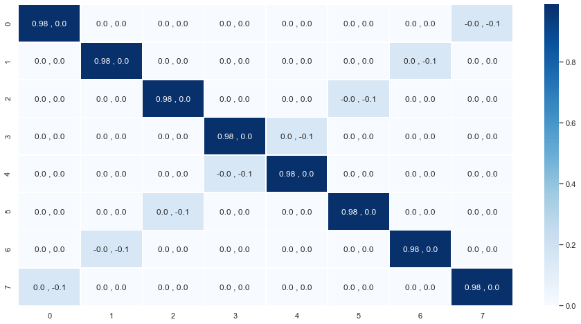
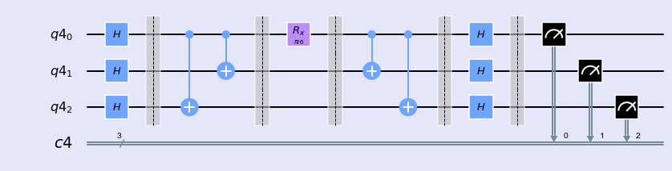
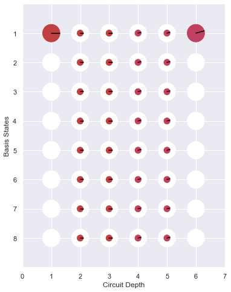
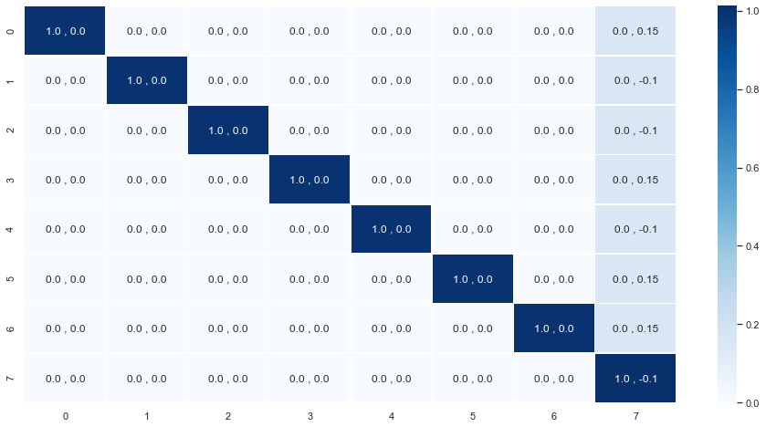
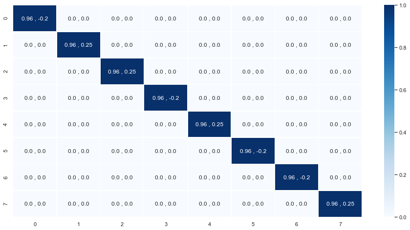

### Universality


```python
%matplotlib inline
import numpy as np
import IPython
import matplotlib.pyplot as plt
from qiskit import QuantumCircuit
from qiskit import execute,BasicAer
from qiskit import QuantumRegister,ClassicalRegister
from qiskit.tools.jupyter import *
from qiskit.visualization import *
import seaborn as sns
sns.set()
```


```python
from helper import *
import os
import glob
import moviepy.editor as mpy
```

$$ R_x(\theta) = e^{i \frac{\theta}{2} X} $$

$$R_x(\theta) = e^{i \frac{\theta}{2} X} = I + i \frac{\theta}{2} X + \frac{(i \frac{\theta}{2} X)^{2}}{2!} + ...$$


```python
qc = QuantumCircuit(1,1)
qc.rx(np.pi/100,0)
qcm1 = qc.copy()
```


```python
I = np.eye(2,2)
X = np.array([[0,1],[1,0]])
U = I + (0+1j)*(np.pi/(2*100))*X
plotMatrix(U)
```





```python
backend = BasicAer.get_backend('unitary_simulator')
job = execute(qcm1, backend)
ndArray = job.result().get_unitary(qcm1, decimals=3)
Matrix = np.matrix(ndArray)
plotMatrix(Matrix)
```


#### Example 1

$$U = e^{i\frac{\theta}{2} X \otimes X \otimes X}$$


```python
QCs =[]
n =3
q = QuantumRegister(n)
c = ClassicalRegister(n)
qc = QuantumCircuit(q,c)
QCs.append(qc.copy())
qc.cx(q[0],q[2])
qc.cx(q[0],q[1])
qc.barrier()
QCs.append(qc.copy())
qc.rx(np.pi/10,q[0])
qc.barrier()
QCs.append(qc.copy())
qc.cx(q[0],q[1])
qc.cx(q[0],q[2])
qcm2 = qc.copy()
qc.barrier()
QCs.append(qc.copy())
qc.measure(q,c)


style = {'backgroundcolor': 'lavender'}
qc.draw(output='mpl', style = style)
```





- Phase


```python
phaseDict = getPhaseDict(QCs)
plotiPhaseCircle(phaseDict,depth =len(phaseDict),path = "uplot",show=True,save=False)
```





    <Figure size 432x288 with 0 Axes>


- Matrix


```python
I3 = np.eye(8,8)
X = np.array([[0,1],[1,0]])
XXX = np.kron(np.kron(X,X),X)
U = I3 + (0+1j)*(np.pi/(2*10))*XXX
plotMatrix(U)
```





```python
backend = BasicAer.get_backend('unitary_simulator')
job = execute(qcm2, backend)
ndArray = job.result().get_unitary(qcm2, decimals=3)
Matrix = np.matrix(ndArray)
plotMatrix(Matrix)
```





#### Example 2

$$U = e^{i\frac{\theta}{2} Z \otimes Z \otimes Z}$$


```python
QCs=[]
n =3
q = QuantumRegister(n)
c = ClassicalRegister(n)
qc = QuantumCircuit(q,c)
QCs.append(qc.copy())
qc.h(q[0])
qc.h(q[1])
qc.h(q[2])
qc.barrier()
QCs.append(qc.copy())
qc.cx(q[0],q[2])
qc.cx(q[0],q[1])
qc.barrier()
QCs.append(qc.copy())
qc.rx(np.pi/6,q[0])
qc.barrier()
QCs.append(qc.copy())
qc.cx(q[0],q[1])
qc.cx(q[0],q[2])
qc.barrier()
QCs.append(qc.copy())
qc.h(q[2])
qc.h(q[1])
qc.h(q[0])
qcm3 = qc.copy()
qc.barrier()
QCs.append(qc.copy())
qc.measure(q,c)

style = {'backgroundcolor': 'lavender'}
qc.draw(output='mpl', style = style)
```





- Phase


```python
phaseDict = getPhaseDict(QCs)
plotiPhaseCircle(phaseDict,depth =len(phaseDict),path = "uplot",show=True,save=False)
```





    <Figure size 432x288 with 0 Axes>


- Matrix


```python
I3 = np.eye(8,8)
Z = np.array([[0,1],[0,-1]])
ZZZ = np.kron(np.kron(Z,Z),Z)
U = I3 + (0+1j)*(np.pi/(2*10))*ZZZ
plotMatrix(U)
```





```python
backend = BasicAer.get_backend('unitary_simulator')
job = execute(qcm3, backend)
ndArray = job.result().get_unitary(qcm3, decimals=3)
Matrix = np.matrix(ndArray)
plotMatrix(Matrix)
```




