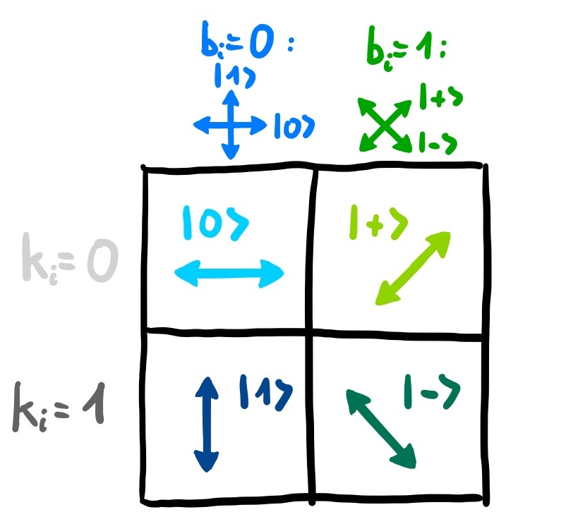
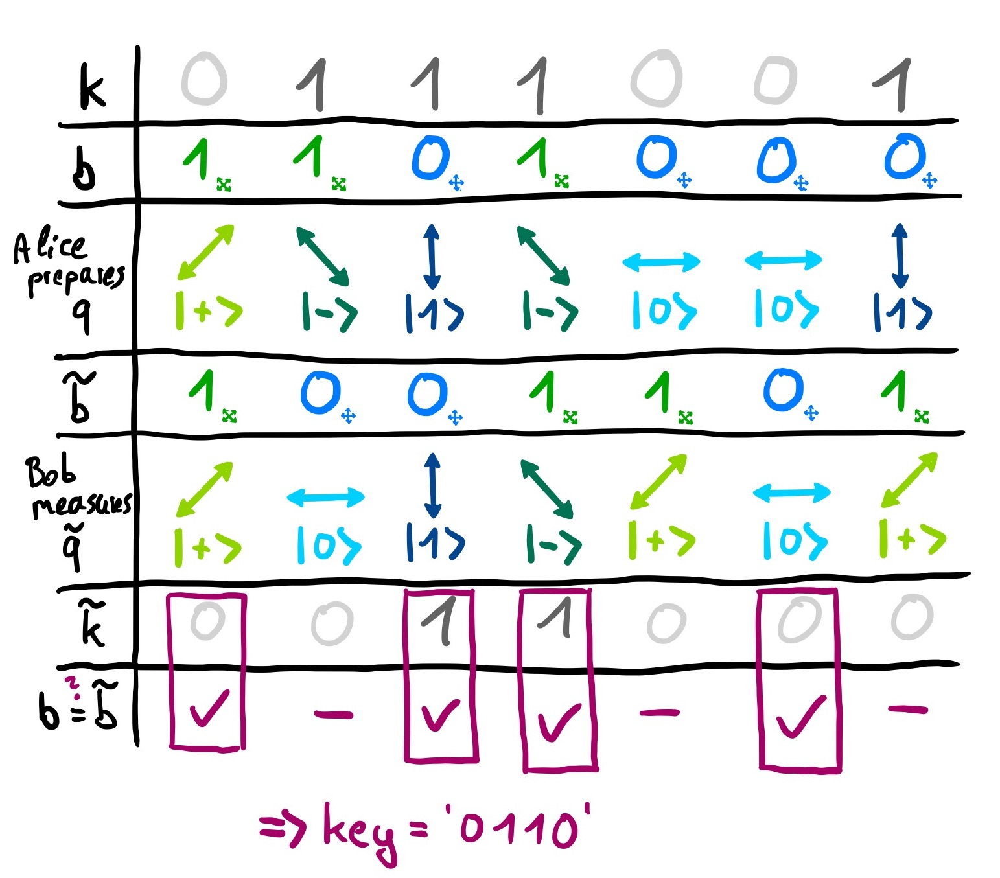
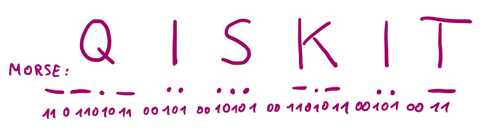

### Quantum Cryptography

**This Notebook is taken from IBM Challenge 2020, [GitHub](https://github.com/qiskit-community/may4_challenge_exercises)**


**[BB84](https://en.wikipedia.org/wiki/BB84)**, is a cryptography protocol developed in 1984 by one of our most famous IBMers, Charles Bennett, together with his colleague Gilles Brassard. The goal of the BB84 protocol is to create a secret key between two parties, Alice and Bob, that can then be used by both parties to encrypt and decrypt a hidden message. In this exercise we will guide you through the different steps of the protocol to create such a secret key to decrypt our encrypted message.

#### BB84 protocol

Let's walk through the steps of the BB84 protocol:

1. In the first step, Alice chooses two random bit strings, $k$ and $b$, that each consist of \\( n \\) bits. Her bit string $k$ contains the actual bits she wants to encode (out of which the key will later be formed), while $b$ determines the bases in which she will encode her bits. For \\( b_i=0 \\) (i.e., if the \\( i^{th} \\) bit is zero), she encodes the \\( i^{th} \\) qubit in the standard \\( \{|0\rangle, |1\rangle \} \\) basis, while for \\(b_i=1\\), she encodes it in the \\( \{|+\rangle, |-\rangle \} \\) basis, where \\( |+\rangle:=\frac{1}{\sqrt{2}}(|0\rangle +|1\rangle) \\), \\( |-\rangle:=\frac{1}{\sqrt{2}}(|0\rangle -|1\rangle) \\). 
This becomes more illustrative when representing each basis by two perpendicular arrows, where the two different bases are rotated by \\( 45^\circ \\).
The encoding of each qubit \\( q_i \\) would therefore look like the following:



2. After encoding her \\( n \\) qubits, Alice sends these qubits to Bob. Bob also chooses a random bit string \\( \tilde{b} \\) consisting of \\( n \\) bits that determines in which bases he is going to perform measurements. He stores the outcomes of his measurements \\( \tilde{k_i} \\) together with the corresponding basis bits \\( \tilde{b_i} \\) in a table.

3. Next, Alice and Bob compare their basis bits \\( b_i \\) and \\( \tilde{b}_i \\). Whenever \\( b_i \neq \tilde{b}_i \\), Bob measured in a different basis than Alice's qubit was encoded in, so he gets each outcome with probability \\( \frac{1}{2} \\). Alice and Bob therefore discard all key bits corresponding to these basis bits. If  \\( b_i = \tilde{b}_i \\), however, they prepared and measured the qubit in the same basis, so (unless someone eavesdropped) Bob will get the key bit that Alice encoded, \\( \tilde{k}_i = k_i \\). These outcomes then compose the key.

#### An illustrated example

Suppose Alice's random bit strings are ( k=`0111001`) and ( b=`1101000`) and Bob's random bit string is (\\( \tilde{b} \\)=`1001101`). Try to understand the other entries in the table below. Note that in the case where the basis bits are different, Bob has a 50% chance to get each outcome, so here one of them was chosen randomly.



The key produced in this example would be '0110'. To make sure that the key is secret and correct, Alice and Bob would "sacrifice" some of their key bits to check that no one eavesdropped. If someone had measured a qubit on the way, this could have changed the state of that qubit and with probability \\(\frac{1}{4} \\), Bob's and Alice's key bits will be different. By checking $m$ bits, the probability to not notice an eavesdropper decreases as \\( \left(\frac{3}{4}\right)^m \\). Thus, if they check enough bits and they are all the same, they can assume that no one eavesdropped and their key is secret. However, to keep things simple, we will not perfom these tests in this excercise. Instead, all bits of the key will be used.

#### Message encrpytion
Once a secret key is distributed, Alice can encrypt her message by using the so-called [one-time pad](https://en.wikipedia.org/wiki/One-time_pad) technique: she simply adds the key bits on top of her secret message bits that she wants to send. Using the example above, her key is \\( \text{key}\\)=`0110`. If her secret message bit string is ( m=`1100` ), the encrypted message will be \\( c=m\oplus \text{key} \mod 2 \\)= `1010`. Bob can then decrypt the message by adding his key on that encrypted message, \\( m=c\oplus \text{key} \mod 2 \\).

#### The challenge 

In the following four tasks, you play the role of Bob. You will create such a secret key with Alice and use it to decrypt the encrypted message from her.

---
For useful tips to complete this exercise as well as pointers for communicating with other participants and asking questions, please take a look at the following [repository](https://github.com/qiskit-community/may4_challenge_exercises). You will also find a copy of these exercises, so feel free to edit and experiment with these notebooks.

---

#### How we simulate this protocol in Qiskit

In this exercise, there are three steps. Each of these three steps is completed $n=100$ times. Before the protocol begins, Alice will choose two random bit strings, $k$ and $b$.

1. Alice will prepare each qubit using the function `Alice_prepare_qubit`, which is already written for you.

2. Bob measures his qubit using a specific set of bases, which we have given you in a variable called `bases`. **You will supply the procedure that Bob takes in the function `Bob_measure_qubit`.**

3. A quantum circuit for this sequence of operations is created. It will be called `this_qubit_circuit` for each qubit, and all such circuits are collected together in an array called `all_qubit_circuits`. We have supplied the code to do this.

Finally, we run `all_qubit_circuits` on the IBM high-performance cloud simulator called `ibmq_qasm_simulator` and collect the results of the measurements into a bitstring called `bits`. We have supplied the code to do this.

You will then follow the protocol to decrypt a message using the extracted key from the BB84 protocol.


#### i) Execute step 2 of the BB84 protocol to get your bitstring
To do so, you need a random bit string \\(\tilde{b}\\) that determines the bases in which you should perform the measurements. In order to reproduce the key that we used to encrypt our secret message, we provide you with this "random" `bases` bit string of 100 bits that uses seed "84".
**Perform measurements in the bases corresponding to the given bit string and return the outcome as a bit string in the form** 
\\( \tilde{b}_0 \tilde{b}_1...\tilde{b}_{n-1} \\). Note that Qiskit returns outcomes always in reverse order, so if \\( |\tilde{q}_0\rangle = |0 \rangle \\) and \\(|\tilde{q}_1\rangle = |\tilde{q}_2\rangle = |1 \rangle \\) , it will return the outcome '110'. You can check whether your bit string is correct by `check_bits(bitstring)`.


```python
%matplotlib inline

# Importing standard Qiskit libraries
import random
from qiskit import execute, Aer, IBMQ
from qiskit.tools.jupyter import *
from qiskit.visualization import *
from may4_challenge.ex3 import alice_prepare_qubit, check_bits, check_key, check_decrypted, show_message

from IPython.display import display, Math, Latex
from may4_challenge.ex1 import return_state, vec_in_braket, statevec


# Configuring account
provider = IBMQ.load_account()
backend = provider.get_backend('ibmq_qasm_simulator')  # with this simulator it wouldn't work \

# Initial setup
random.seed(84) # do not change this seed, otherwise you will get a different key

# This is your 'random' bit string that determines your bases
numqubits = 100
bob_bases = str('{0:0100b}'.format(random.getrandbits(numqubits)))

def bb84():
    print('Bob\'s bases:', bob_bases)

    # Now Alice will send her bits one by one...
    all_qubit_circuits = []
    for qubit_index in range(numqubits):

        # This is Alice creating the qubit
        thisqubit_circuit = alice_prepare_qubit(qubit_index)

        # This is Bob finishing the protocol below
        bob_measure_qubit(bob_bases, qubit_index, thisqubit_circuit)

        # We collect all these circuits and put them in an array
        all_qubit_circuits.append(thisqubit_circuit)
    
    # Now execute all the circuits for each qubit
    results = execute(all_qubit_circuits, backend=backend, shots=1).result()

    # And combine the results
    bits = ''
    for qubit_index in range(numqubits):
        bits += [measurement for measurement in results.get_counts(qubit_index)][0]
        
    return bits

# Here is your task
def bob_measure_qubit(bob_bases, qubit_index, qubit_circuit):
    # insert your code here to measure Alice's bits
    current_base_element = bob_bases[qubit_index]
    
    #print(current_base_element)
    #state = statevec(qubit_circuit) # determine final state after running the circuit
    #display(Math(vec_in_braket(state.data)))
    
    
    if current_base_element == '0':
        qubit_circuit.measure(0,0)
    elif current_base_element == '1':
        qubit_circuit.h(0)
        qubit_circuit.measure(0,0)
        
    

bits = bb84()        
print('Bob\'s bits: ', bits)
check_bits(bits)
```

    ibmqfactory.load_account:WARNING:2020-05-05 00:37:47,366: Credentials are already in use. The existing account in the session will be replaced.


    Bob's bases: 1100111010011111111111110100000111010100100010011001001110100001010010111011010001011001111111011111
    Bob's bits:  1000001000011100001110000010000111100101000111000101010010000110000000111100000101100001101101001001
    So far, so good 🎉! You got the right bits!


After you performed your measurements, Alice announces her bases bits:
$$
b = 1000000000010001111111001101100101000111110100110111111000110000011000001001100011100111010010000110
$$ 


#### ii) Execute step 3 of the BB84 protocol to extract the key
To do so, compare Alice's bases bits $b$ to your bases bits \\( \tilde{b} \\) (given in the previous step) and extract the key by keeping only the outcomes when your bases were the same.
You can check whether your key is correct by `check_key(key)`.


```python
alice_bases = '10000000000100011111110011011001010001111101001101111110001100000110000010011000111'\
              '00111010010000110' # Alice's bases bits
key =''
for i in range(len(bits)):
    if alice_bases[i] == bob_bases[i]:
        key = key + bits[i]
print(key)
check_key(key)
```

    10000010001110010011101001010000110000110011100000
    So far, so good 🎉! You got the right key!


Using this key, Alice can now send you her private encrypted message. While for full security a key would only be used once, she will now use her 50-bit-long key four times in a row to encrypt her 200-bit-long message. Her encrypted message is

$$
m = 0011011010100011101000001100010000001000011000101110110111100111111110001111100011100101011010111010\\
\qquad 1110100011101010010111111100101000011010011011011011101111010111000101111111001010101001100101111011
$$

#### iii) Decrypt the message using the extracted key
The [message encryption](#Message-encrpytion) section in the introduction describes how to do so. You can check whether your decrypted message bit string is correct by `check_decrypted(decrypted)`.


```python
m = '0011011010100011101000001100010000001000011000101110110111100111111110001111100011100101011010111010111010001'\
    '1101010010111111100101000011010011011011011101111010111000101111111001010101001100101111011' # encrypted message
decrypted = ''
for i,t in enumerate(m):
    #print(i,t)
    im = (int(t) + int(key[i%50]))%2
    decrypted = decrypted+str(im)
    
check_decrypted(decrypted)
```

    So far, so good 🎉! You decrypted the message!


Of course there is an actual message encoded in this bit string. To encode letters, Alice used Morse code (see here for more details: https://en.wikipedia.org/wiki/Morse_code). However, as she could only send zeros and ones and wanted to keep her message as short as possible, she encoded 

- a dot ("dit") as '1'
- a dash ("dah") as '11'
- an intra-character gap (between each dot and dash within a character) as '0'
- a short gap (that separates letters) as '00'
- a medium gap (that separates words) as '000'.

Here is an example:


#### iv) Try to decode Alice's message!
In a first step, convert the decrypted message from above into morse code. In a second step, use the provided dictionary to decode the morse code. Copy and paste the solution string on the IBM Quantum Challenge page to complete the exercise and track your progress.


```python
decrypted
```


    '10110100100110101001101010010100110010110101101011001101011010011011011001101100110101011010010110100110101011010011011001011001101011011001010101011001101101011001010110010110011010011001010110011011'


```python
MORSE_CODE_DICT = { 'a':'.-', 'b':'-...', 
                    'c':'-.-.', 'd':'-..', 'e':'.', 
                    'f':'..-.', 'g':'--.', 'h':'....', 
                    'i':'..', 'j':'.---', 'k':'-.-', 
                    'l':'.-..', 'm':'--', 'n':'-.', 
                    'o':'---', 'p':'.--.', 'q':'--.-', 
                    'r':'.-.', 's':'...', 't':'-', 
                    'u':'..-', 'v':'...-', 'w':'.--', 
                    'x':'-..-', 'y':'-.--', 'z':'--..', 
                    '1':'.----', '2':'..---', '3':'...--', 
                    '4':'....-', '5':'.....', '6':'-....', 
                    '7':'--...', '8':'---..', '9':'----.', 
                    '0':'-----', ', ':'--..--', '.':'.-.-.-', 
                    '?':'..--..', '/':'-..-.', '-':'-....-', 
                    '(':'-.--.', ')':'-.--.-'} 
MCODE = ''
dec = decrypted
while len(dec)>3:
    if dec[0] == '1' and dec[0:2] != '11':
        MCODE =MCODE + '.'
        dec = dec[1:]
    if dec[0:2] == '11' and len(dec)>1:
        MCODE =MCODE + '-'
        dec = dec[2:]
    if dec[0] == '0' and dec[0:2] != '00'and dec[0:3] != '000' and len(dec)>3:
        MCODE =MCODE + ''
        dec = dec[1:]
    if dec[0:2] == '00'and dec[0:3] != '000' and len(dec)>3:
        MCODE =MCODE + '+' # seperates letters
        dec = dec[2:]
    if dec[0:3] == '000' and i < len(dec)-3 and len(dec)>3:
        MCODE =MCODE + 'x' # seperates words
        dec = dec[3:]
        
MCODE = MCODE +'--'

RDICT = {}        
for k,v in MORSE_CODE_DICT.items():
    RDICT.update({v:k})

MID = MCODE.split("+")
solution = ''
for item in MID:
    #print(RDICT[item])
    solution = solution+RDICT[item]
solution = solution[0:-1]+'m'
    
show_message(solution)
```


<p style="border: 2px solid black; padding: 2rem;">
    Congratulations 🎉! Submit the following text
    <samp
        style="font-family: monospace; background-color: #eee;"
    >reddit.com/r/may4quantum</samp>
    on the
    <a href="https://quantum-computing.ibm.com/challenges/4anniversary/?exercise=3&amp;answer=reddit.com%2Fr%2Fmay4quantum" target="_blank">
        IBM Quantum Challenge page
    </a>
    to see if you are correct.
</p>


