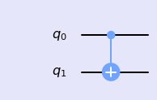
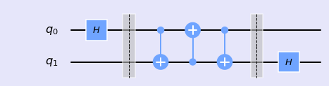
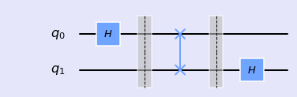
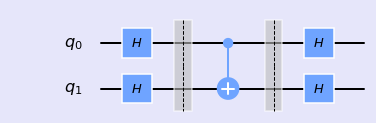
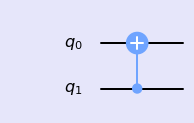
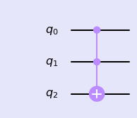

### CNOT gate

<div class="alert alert-block alert-info">
Multiqubit gate  requires multiple qubit circuit.
</div>


```python
%matplotlib inline
import numpy as np
import IPython
import matplotlib.pyplot as plt
from qiskit import QuantumCircuit
from qiskit import BasicAer
from qiskit.tools.jupyter import *
from qiskit.visualization import *
import seaborn as sns
sns.set()
```


```python
from helper import *
import os
import glob
import moviepy.editor as mpy
```
#### CNOT gate

This gate is a conditional gate that performs an X-gate on the second qubit (target), if the state of the first qubit (control) is  |1⟩ .


```python
qc = QuantumCircuit(2)
qc.cx(0,1)
style = {'backgroundcolor': 'lavender'}
qc.draw(output='mpl', style = style)
```





Let's see the matrix element of the CNOT gate.


```python
getMatrix(qc)
```


    matrix([[1.+0.j, 0.+0.j, 0.+0.j, 0.+0.j],
            [0.+0.j, 0.+0.j, 0.+0.j, 1.+0.j],
            [0.+0.j, 0.+0.j, 1.+0.j, 0.+0.j],
            [0.+0.j, 1.+0.j, 0.+0.j, 0.+0.j]])


CNOT gate has two representation based on which qubit is target.

$$\text{CNOT} = \left( \begin{array}{cccc} 1 & 0 & 0 & 0 \\\
                              0 & 0 & 0 & 1 \\\
                              0 & 0 & 1 & 0 \\\
                              0 & 1 & 0 & 0 \\\
              \end{array} \right) , \quad
\text{CNOT} = \left( \begin{array}{cccc}  1 & 0 & 0 & 0 \\\
                              0 & 1 & 0 & 0 \\\
                              0 & 0 & 0 & 1 \\\
                              0 & 0 & 1 & 0 \\\
              \end{array} \right)$$

#### SWAP gate

- What will happen if we apply 3 CNOT gates as shown below?


```python
qc = QuantumCircuit(2)
qc.h(0)
qc.barrier()
qc.cx(0,1)
qc.cx(1,0)
qc.cx(0,1)
qc.barrier()
qc.h(1)
print(getStateVector(qc))
style = {'backgroundcolor': 'lavender'}
qc.draw(output='mpl', style = style)
```

    [1.-6.123234e-17j 0.+0.000000e+00j 0.+0.000000e+00j 0.+0.000000e+00j]





In fact, these three CNOT gates are creating SWAP gate. Let's check.


```python
qc = QuantumCircuit(2)
qc.h(0)
qc.barrier()
qc.swap(0,1)
qc.barrier()
qc.h(1)
print(getStateVector(qc))
style = {'backgroundcolor': 'lavender'}
qc.draw(output='mpl', style = style)
```

    [1.-6.123234e-17j 0.+0.000000e+00j 0.+0.000000e+00j 0.+0.000000e+00j]





#### Circuit Identity

|+> and |-> state are Hadamard basis. Lets see the effect of this basis change.


```python
qc = QuantumCircuit(2)
qc.h(0)
qc.h(1)
qc.barrier()
qc.cx(0,1)
qc.barrier()
qc.h(0)
qc.h(1)
print(getStateVector(qc))
style = {'backgroundcolor': 'lavender'}
qc.draw(output='mpl', style = style)
```

    [1.-1.2246468e-16j 0.+0.0000000e+00j 0.+0.0000000e+00j 0.+0.0000000e+00j]





The above circuit is equivalent to the following circuit.


```python
qc = QuantumCircuit(2)
qc.cx(1,0)
print(getStateVector(qc))
style = {'backgroundcolor': 'lavender'}
qc.draw(output='mpl', style = style)
```

    [1.+0.j 0.+0.j 0.+0.j 0.+0.j]





#### Toffoli Gate

The Toffoli gate is a three-qubit gate with two controls and one target. It performs an X on the target only if both controls are in the state |1⟩. A Toffoli can also be thought of as a controlled-controlled-NOT, and is also called the CCX gate.


```python
qc = QuantumCircuit(3)
qc.ccx(0,1,2)
print(getStateVector(qc))
style = {'backgroundcolor': 'lavender'}
qc.draw(output='mpl', style = style)
```

    [1.-5.55111512e-17j 0.+0.00000000e+00j 0.+0.00000000e+00j
     0.+0.00000000e+00j 0.+0.00000000e+00j 0.+0.00000000e+00j
     0.+0.00000000e+00j 0.+0.00000000e+00j]





Lets see the matrix form of Tiffoli gate.


```python
getMatrix(qc)
```


    matrix([[1.-0.j, 0.+0.j, 0.+0.j, 0.+0.j, 0.+0.j, 0.+0.j, 0.+0.j, 0.+0.j],
            [0.+0.j, 1.-0.j, 0.+0.j, 0.+0.j, 0.+0.j, 0.+0.j, 0.+0.j, 0.+0.j],
            [0.+0.j, 0.+0.j, 1.-0.j, 0.+0.j, 0.+0.j, 0.+0.j, 0.+0.j, 0.+0.j],
            [0.+0.j, 0.+0.j, 0.+0.j, 0.+0.j, 0.+0.j, 0.+0.j, 0.+0.j, 1.-0.j],
            [0.+0.j, 0.+0.j, 0.+0.j, 0.+0.j, 1.-0.j, 0.+0.j, 0.+0.j, 0.+0.j],
            [0.+0.j, 0.+0.j, 0.+0.j, 0.+0.j, 0.+0.j, 1.-0.j, 0.+0.j, 0.+0.j],
            [0.+0.j, 0.+0.j, 0.+0.j, 0.+0.j, 0.+0.j, 0.+0.j, 1.-0.j, 0.+0.j],
            [0.+0.j, 0.+0.j, 0.+0.j, 1.-0.j, 0.+0.j, 0.+0.j, 0.+0.j, 0.+0.j]])


```python

```
