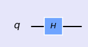

## Hadamard Gate 

<div class="alert alert-block alert-info">
Hadamard gate superpose the quantum state uniformly.
</div>


```python
%matplotlib inline
import numpy as np
import IPython
import matplotlib.pyplot as plt
from qiskit import QuantumCircuit
from qiskit import BasicAer
from qiskit.tools.jupyter import *
from qiskit.visualization import *
import seaborn as sns
sns.set()
```


```python
from helper import *
import glob
import moviepy.editor as mpy
```

#### Hadamard Gate (1 qubit)


```python
qc = QuantumCircuit(1)
qc.h(0)
style = {'backgroundcolor': 'lavender'}
qc.draw(output='mpl', style = style)
```





- Single qubit state vector


```python
backend = BasicAer.get_backend('statevector_simulator')
job = execute(qc,backend).result()
vec1 = job.get_statevector(qc)
vec1
```


    array([0.70710678+0.j, 0.70710678+0.j])


```python
getBlochSphere(qc)
```


- Single qubit Matrix representation


```python
backend = BasicAer.get_backend('unitary_simulator')
job = execute(qc, backend)
ndArray = job.result().get_unitary(qc, decimals=3)
HM1 = np.matrix(ndArray)
HM1
```


    matrix([[ 0.707+0.j,  0.707-0.j],
            [ 0.707+0.j, -0.707+0.j]])


####  Hadamard Gate (2 qubits)

- Define circuit


```python
qc = QuantumCircuit(2)
qc.h(0)
qc.h(1)

style = {'backgroundcolor': 'lavender'}
qc.draw(output='mpl', style = style)
```


- State vector (ket, phase and measurement)


```python
backend = BasicAer.get_backend('statevector_simulator')
job = execute(qc,backend).result()
vec2 = job.get_statevector(qc)
vec2
```


    array([0.5+0.j, 0.5+0.j, 0.5+0.j, 0.5+0.j])


- two qubit state vector  as tensor product


    
 Since this circuit consists of pure superposition brought up by hadamard gate, it is possible to obtain final state vector by taking direct product of single qubit states. Results from operation of H gate on single qubit can be multiplied with direct product operation to get final state.
    
$$ \frac{1}{\sqrt{2}} (|0 \rangle + | 1\rangle) \otimes \frac{1}{\sqrt{2}}(|0 \rangle + | 1\rangle) = \frac{1}{2}(|00 \rangle + |01 \rangle + |10 \rangle + |11 \rangle $$
    

i.e., $$\frac{1}{\sqrt{2}}\left( \begin{array}{cc} 
    1   \\\
    1 
\end{array} \right) \otimes \frac{1}{\sqrt{2}} \left( \begin{array}{cc}
    1   \\\
    1 
\end{array}\right) = \frac{1}{2}\left( \begin{array}{cc}
    1   \\\
    1 \\\
    1 \\\
    1
\end{array}\right)$$

Where \\(|00 \rangle , |01 \rangle , |10 \rangle \\) and \\( |11 \rangle \\) are basis states for two qubit system.


```python
vec2 = np.kron(vec1,vec1)
vec2
```


    array([0.5+0.j, 0.5+0.j, 0.5+0.j, 0.5+0.j])


- Matrix Representation


Based on above Bell circuit, lets construct the matrix representation of the circuit using fundamental gates matrices involved in the circuit.

$$H = \frac{1}{\sqrt{2}} \left( \begin{array}{cc}
    1  & 1 \\\
    1 & -1
\end{array}\right)$$

- Matrix representation of above quantum circuit

$$ U  = H \otimes H =  \left( \begin{array}{cc}
    H  &  H \\\
    H &  -H
\end{array} \right)$$
    


```python
backend = BasicAer.get_backend('unitary_simulator')
job = execute(qc, backend)
ndArray = job.result().get_unitary(qc, decimals=3)
UM2 = np.matrix(ndArray)
UM2
```


    matrix([[ 0.5+0.j,  0.5-0.j,  0.5-0.j,  0.5-0.j],
            [ 0.5+0.j, -0.5+0.j,  0.5-0.j, -0.5+0.j],
            [ 0.5+0.j,  0.5-0.j, -0.5+0.j, -0.5+0.j],
            [ 0.5+0.j, -0.5+0.j, -0.5+0.j,  0.5-0.j]])


```python
H = 1/np.sqrt(2)*np.array([[1,1],[1,-1]])
U = np.kron(H,H)
print(U)
```

    [[ 0.5  0.5  0.5  0.5]
     [ 0.5 -0.5  0.5 -0.5]
     [ 0.5  0.5 -0.5 -0.5]
     [ 0.5 -0.5 -0.5  0.5]]


- Exercise: Hadamard Gate (3 qubits)

Consider a 3 qubits quantum circuit with H gate applied to each qubit.


```python
qc = QuantumCircuit(3)
for k in range(3):
    qc.h(k)
style = {'backgroundcolor': 'lavender'}
qc.draw(output='mpl', style = style)
```


\\(\textbf{Exercise:}\\) Using above quantum circuit, find final state vector in ket notation, phase plot and measurement simulation histogram.

-----------

\\( \textbf{Exercise:}\\) Using above circuit, find final state vector by implementing tensor product of three single qubit states.
   
------------   
   
\\( \textbf{Hint}\\): \\(| \psi \rangle =  \frac{1}{\sqrt{2}} (|0 \rangle + | 1\rangle) \otimes \frac{1}{\sqrt{2}} (|0 \rangle + | 1\rangle)  \otimes \frac{1}{\sqrt{2}} (|0 \rangle + | 1\rangle) \\)

-------------

\\( \textbf{Exercise:}\\) Using above circuit, find matrix representation of the quantum circuit by implementing tensor product of fundamental gate matrices.
    
\\( \textbf{Hint} :  U = H \otimes H \otimes H  \\) 

--------------


#### A fun Experiment


```python
qc = QuantumCircuit(2)
for i in range(10):
    if i > 1 and i%2==0:
        qc.barrier()
    qc.h(0) 
    qc.h(1)
```


```python
style = {'backgroundcolor': 'lavender'}
qc.draw(output='mpl', style = style)
```


- Get Bloch


- Get Phase


```python

```
