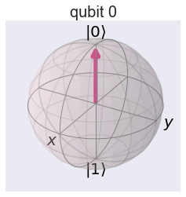
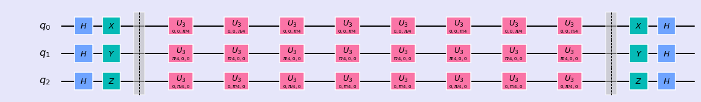

### Pauli-gates

<div class="alert alert-block alert-info">
Pauli Gates ase based on Pauli matrices. These are special matrices; both Hermitian and Unitary.
</div>


```python
%matplotlib inline
import numpy as np
import IPython
import matplotlib.pyplot as plt
from qiskit import QuantumCircuit
from qiskit import BasicAer
from qiskit.tools.jupyter import *
from qiskit.visualization import *
import seaborn as sns
sns.set()
```


```python
from helper import *
import os
import glob
import moviepy.editor as mpy
```

--------

Pauli Gates are represented by \\( X, Y, Z \\)and their matrix form are:


$$ X = \frac{1}{\sqrt{2}} \left( \begin{array}{cc}
    0  & 1 \\\
    1 &  0
\end{array} \right); Y = \frac{1}{\sqrt{2}} \left( \begin{array}{cc}
    0  & -i \\\
    i &  0
\end{array} \right); Z = \frac{1}{\sqrt{2}} \left( \begin{array}{cc}
    1  & 0 \\\
    0 &  -1
\end{array} \right)$$

Lets see what happens to the qubit by application of these gates

#### X-Gate

X gate takes \\( |0 \rangle\\) to \\( |1 \rangle \\) and vise versa. This gate rotates the qubit by \\(\pi \\) angle around X axis.


```python
qc = QuantumCircuit(1)
qc.x(0)
style = {'backgroundcolor': 'lavender'}
qc.draw(output='mpl', style = style)
```


```python
print(getStateVector(qc))
getBlochSphere(qc)
```

    [0.+0.j 1.+0.j]


**Which vector will be unaffected by this rotation?** A vector pointing along x-axis remains unaffected. We can show this by creating a qubit pointing in x-axis by application of H gate and apply x gate


```python
qc = QuantumCircuit(1)
qc.h(0)
qc.x(0)
style = {'backgroundcolor': 'lavender'}
qc.draw(output='mpl', style = style)
```


```python
print(getStateVector(qc))
getBlochSphere(qc)
```

    [0.70710678+0.j 0.70710678+0.j]


```python
qc = QuantumCircuit(1)
qc.x(0)
qc.h(0)
qc.x(0)
style = {'backgroundcolor': 'lavender'}
qc.draw(output='mpl', style = style)
```

In fact, you discovered the eigen vector of X operator. These are represented as:

$$|+\rangle = \tfrac{1}{\sqrt{2}}(|0\rangle + |1\rangle) = \tfrac{1}{\sqrt{2}}\begin{bmatrix} 1 \\ 1 \end{bmatrix}$$

$$|-\rangle = \tfrac{1}{\sqrt{2}}(|0\rangle - |1\rangle) = \tfrac{1}{\sqrt{2}}\begin{bmatrix} 1 \\ -1 \end{bmatrix}$$

#### Y-Gate

This gate rotates the qubit around Y axis by $\pi$ angle.


```python
qc = QuantumCircuit(1)
qc.h(0)
qc.y(0)
style = {'backgroundcolor': 'lavender'}
qc.draw(output='mpl', style = style)
```


```python
print(getStateVector(qc))
getBlochSphere(qc)
```

    [ 0.70710678+0.00000000e+00j -0.70710678+8.65956056e-17j]


**Which vector will be unaffected by this rotation?** A vector pointing along y-axis remains unaffected. We can show this by creating a qubit pointing in x-axis by application of H gate and rotate it to the direction og y-axis and apply Y gate.


```python
qc = QuantumCircuit(1)
qc.h(0)
qc.u3(0,0,np.pi/2,0)
style = {'backgroundcolor': 'lavender'}
qc.draw(output='mpl', style = style)
```


```python
print(getStateVector(qc))
getBlochSphere(qc)
```

    [7.07106781e-01+0.j         2.00307049e-16+0.70710678j]


```python
qc = QuantumCircuit(1)
qc.h(0)
qc.u3(0,0,np.pi/2,0)
qc.x(0)
style = {'backgroundcolor': 'lavender'}
qc.draw(output='mpl', style = style)
```


```python
print(getStateVector(qc))
getBlochSphere(qc)
```

    [7.07106781e-01+0.j         2.00307049e-16-0.70710678j]


In fact, you discovered the eigen vector of Y operator. These are represented as:

$$|\circlearrowright\rangle = \frac{1}{\sqrt{2}}\left(|0\rangle + i|1\rangle\right)$$.

$$|\circlearrowleft\rangle = \frac{1}{\sqrt{2}}\left(|0\rangle - i|1\rangle\right)$$.

#### Z-gate

This gate rotates the qubit around Z axis by $\pi$ angle.


```python
qc = QuantumCircuit(1)
qc.h(0)
qc.z(0)
style = {'backgroundcolor': 'lavender'}
qc.draw(output='mpl', style = style)
```


```python
print(getStateVector(qc))
getBlochSphere(qc)
```

    [ 0.70710678+0.00000000e+00j -0.70710678+8.65956056e-17j]


**Which vector will be unaffected by this rotation?** A vector pointing along z-axis remains unaffected. This is the initial value of qubit which is very easy to verify.


```python
qc = QuantumCircuit(1)
qc.z(0)
style = {'backgroundcolor': 'lavender'}
qc.draw(output='mpl', style = style)
```


```python
print(getStateVector(qc))
getBlochSphere(qc)
```

    [1.+0.j 0.+0.j]





Similarly, you discovered the eigen vector of Z operator. These are represented as:

$$|0 \rangle = \frac{1}{\sqrt{2}}\left(| + \rangle + |- \rangle\right) $$.

$$|1 \rangle = \frac{1}{\sqrt{2}}\left(|+ \rangle + |- \rangle\right) $$

#### Multiple Pauli Gates


```python
qc = QuantumCircuit(3)
qc.x(0)
qc.y(1)
qc.z(2)
qc.barrier()
qc.x(0)
qc.y(1)
qc.z(2)
qc.barrier()
style = {'backgroundcolor': 'lavender'}
qc.draw(output='mpl', style = style)
```


```python
print(getStateVector(qc))
getBlochSphere(qc)
```

    [1.-2.4492936e-16j 0.+0.0000000e+00j 0.+0.0000000e+00j 0.+0.0000000e+00j
     0.+0.0000000e+00j 0.+0.0000000e+00j 0.+0.0000000e+00j 0.+0.0000000e+00j]


#### Making Fun 

Lets apply H gate to each qubit in 3 qubits system and then apply X,Y,and Z gate respectively. This operation followed by total 2 $\pi$ roatation and another set of Pauli gates and H gates brings the qubit to original position.


```python
qc = QuantumCircuit(3)
qc.h(0)
qc.h(1)
qc.h(2)
qc.x(0)
qc.y(1)
qc.z(2)
qc.barrier()
for i in range(8):
    qc.u3(0,0,np.pi/4,0)
    qc.u3(np.pi/4,0,0,1) 
    qc.u3(0,np.pi/4,0,2)
qc.barrier()
qc.x(0)
qc.y(1)
qc.z(2)
qc.h(0)
qc.h(1)
qc.h(2)

style = {'backgroundcolor': 'lavender'}
qc.draw(output='mpl', style = style)
```





Lets see where are our individual qubits, finally!


```python
print(getStateVector(qc))
getBlochSphere(qc)
```

    [1.-8.41170949e-17j 0.+0.00000000e+00j 0.+0.00000000e+00j
     0.+0.00000000e+00j 0.+0.00000000e+00j 0.+0.00000000e+00j
     0.+0.00000000e+00j 0.+0.00000000e+00j]


Lets see what actually happens to each qubit in the intermediate steps:


We can also visualize the 8 complex cofficients for the state vector in the intermediate steps


```python

```
