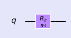
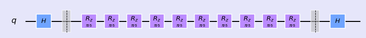
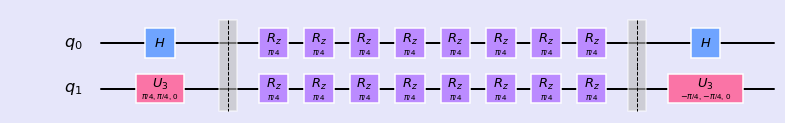

###  R-phi Gate

<div class="alert alert-block alert-info">
The Rϕ-gate performs a rotation of  𝜙  around the Z-axis. It has the matrix:

$$ R_\phi = \begin{bmatrix} 1 & 0 \\ 0 & e^{i\phi} \end{bmatrix}$$
</div>


```python
%matplotlib inline
import numpy as np
import IPython
import matplotlib.pyplot as plt
from qiskit import QuantumCircuit
from qiskit.tools.jupyter import *
from qiskit.visualization import *
import seaborn as sns
sns.set()
```


```python
from helper import *
import os
import glob
import moviepy.editor as mpy
```

#### R-Phi (1 qubit)


```python
qc1 = QuantumCircuit(1)
qc1.rz(np.pi/4, 0)

style = {'backgroundcolor': 'lavender'}
qc1.draw(output='mpl', style = style)
```





```python
getStateVector(qc1)
```


    array([1.+0.j, 0.+0.j])


```python
getBlochSphere(qc1)
```


#### R-phi (2 qubits)


```python
qc2 = QuantumCircuit(2)
qc2.rz(np.pi/4, 0)
qc2.rz(np.pi/4, 1)
style = {'backgroundcolor': 'lavender'}
qc2.draw(output='mpl', style = style)
```


#### Fun Experiment (1 qubit)


```python
qc_e1 = QuantumCircuit(1)
qc_e1.h(0)
qc_e1.barrier()
for i in range(10):
    qc_e1.rz(np.pi/5, 0)   
qc_e1.barrier()
qc_e1.h(0)
style = {'backgroundcolor': 'lavender'}
qc_e1.draw(output='mpl', style = style)
```





- Get Bloch


- Get Phase


#### Fun Experiment (2 qubits)


```python
qc = QuantumCircuit(2)
qc.h(0)
qc.u3(np.pi/4,np.pi/4,0,1)
qc.barrier()
for i in range(8):
    qc.rz(np.pi/4, 0) 
    qc.rz(np.pi/4, 1)
    
qc.barrier()
qc.h(0)
qc.u3(-np.pi/4,-np.pi/4,0,1)
style = {'backgroundcolor': 'lavender'}
qc.draw(output='mpl', style = style)
```





- Get Bloch


- Get Phase


#### Special R-phi Gates: 

\\( R_{\phi}\\) gate is reprisented by \\(S\\) gate when \\( \phi = \pi/2 \\). It is also called \\( \sqrt{Z} \\) gate.

$$ S = \left( \begin{array}{cc} 1 & 0 \\\
0 & e^{\frac{i\pi}{2}} \end{array}\right), \quad  S^\dagger = \left( \begin{array}{cc} 1 & 0 \\\
0 & e^{-\frac{i\pi}{2}} \end{array}\right) $$


\\( R_{\phi} \\) gate is reprisented by \\( T \\) gate when \\( \phi = \pi/4 \\).

$$T = \left( \begin{array} 1 & 0 \\\
0 & e^{\frac{i\pi}{4}} \end{array}\right), \quad  T^\dagger = \left( \begin{array}{cc} 1 & 0 \\\
0 & e^{-\frac{i\pi}{4}} \end{array}\right)$$

