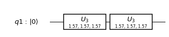
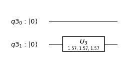
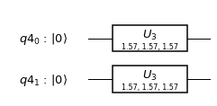
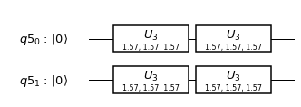
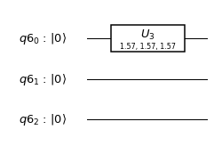
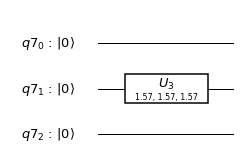
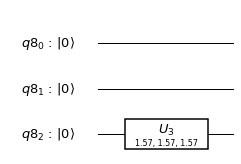
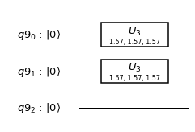
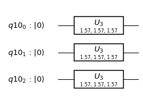
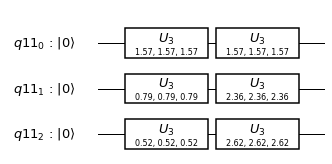

### Single Qubit Gates

###### Latest python notebook is available [here](https://github.com/q4quanta/quantum-circuits)


```python
# Useful additional packages
import matplotlib.pyplot as plt
%matplotlib inline
import numpy as np
from math import pi
```


```python
from qiskit import QuantumCircuit, ClassicalRegister, QuantumRegister, execute
from qiskit.tools.visualization import circuit_drawer
from qiskit.quantum_info import state_fidelity
from qiskit import BasicAer

backend = BasicAer.get_backend('unitary_simulator')
```

### U - gates

#### 1. Single qubit circuit:

Base states : |0>, |1>


```python
q = QuantumRegister(1)
qc = QuantumCircuit(q)
qc.u3(pi/2,pi/2,pi/2,q)
qc.draw(output='mpl')
```


```python
job = execute(qc, backend)
job.result().get_unitary(qc, decimals=3)
```


    array([[ 0.707+0.j   ,  0.   -0.707j],
           [ 0.   +0.707j, -0.707+0.j   ]])


#### 1.1. Gates in series


```python
q = QuantumRegister(1)
qc = QuantumCircuit(q)
qc.u3(pi/2,pi/2,pi/2,q)
qc.u3(pi/2,pi/2,pi/2,q)
qc.draw(output='mpl')
```





```python
job = execute(qc, backend)
job.result().get_unitary(qc, decimals=3)
```


    array([[1.+0.j, 0.+0.j],
           [0.+0.j, 1.+0.j]])


----------

#### 2.  Double qubit circuit

Base states: |00>, |01>, |10>,|11>

###### 2.1. $$I \otimes U$$


```python
q = QuantumRegister(2)
qc = QuantumCircuit(q)
qc.u3(pi/2,pi/2,pi/2,q[0])
qc.draw(output='mpl')
```


```python
job = execute(qc, backend)
job.result().get_unitary(qc, decimals=3)
```


    array([[ 0.707+0.j   ,  0.   -0.707j,  0.   +0.j   ,  0.   +0.j   ],
           [ 0.   +0.707j, -0.707+0.j   ,  0.   +0.j   ,  0.   +0.j   ],
           [ 0.   +0.j   ,  0.   +0.j   ,  0.707+0.j   ,  0.   -0.707j],
           [ 0.   +0.j   ,  0.   +0.j   ,  0.   +0.707j, -0.707+0.j   ]])


###### 2.2. $$U \otimes I$$


```python
q = QuantumRegister(2)
qc = QuantumCircuit(q)
qc.u3(pi/2,pi/2,pi/2,q[1])
qc.draw(output='mpl')
```





```python
job = execute(qc, backend)
job.result().get_unitary(qc, decimals=3)
```


    array([[ 0.707+0.j   ,  0.   +0.j   ,  0.   -0.707j,  0.   +0.j   ],
           [ 0.   +0.j   ,  0.707+0.j   ,  0.   +0.j   ,  0.   -0.707j],
           [ 0.   +0.707j,  0.   +0.j   , -0.707+0.j   ,  0.   +0.j   ],
           [ 0.   +0.j   ,  0.   +0.707j,  0.   +0.j   , -0.707+0.j   ]])


###### 2.3 $$U \otimes U$$


```python
q = QuantumRegister(2)
qc = QuantumCircuit(q)
qc.u3(pi/2,pi/2,pi/2,q[0])
qc.u3(pi/2,pi/2,pi/2,q[1])
qc.draw(output='mpl')
```





```python
job = execute(qc, backend)
job.result().get_unitary(qc, decimals=3)
```


    array([[ 0.5+0.j ,  0. -0.5j,  0. -0.5j, -0.5+0.j ],
           [ 0. +0.5j, -0.5+0.j ,  0.5+0.j ,  0. +0.5j],
           [ 0. +0.5j,  0.5+0.j , -0.5+0.j ,  0. +0.5j],
           [-0.5+0.j ,  0. -0.5j,  0. -0.5j,  0.5+0.j ]])


#### 2.4.  $$(U \times U) \otimes (U\times U)$$


```python
q = QuantumRegister(2)
qc = QuantumCircuit(q)
qc.u3(pi/2,pi/2,pi/2,q[0])
qc.u3(pi/2,pi/2,pi/2,q[0])
qc.u3(pi/2,pi/2,pi/2,q[1])
qc.u3(pi/2,pi/2,pi/2,q[1])
qc.draw(output='mpl')
```





```python
job = execute(qc, backend)
job.result().get_unitary(qc, decimals=3)
```


    array([[1.+0.j, 0.+0.j, 0.+0.j, 0.+0.j],
           [0.+0.j, 1.+0.j, 0.+0.j, 0.+0.j],
           [0.+0.j, 0.+0.j, 1.+0.j, 0.+0.j],
           [0.+0.j, 0.+0.j, 0.+0.j, 1.+0.j]])


------------------

#### 3. Three qubit circuit

Base states: |000>,|001>,|010>,|011>,|100>,|110>,|101>,|111>

###### 3.1.  $$I \otimes I \otimes U$$


```python
q = QuantumRegister(3)
qc = QuantumCircuit(q)
qc.u3(pi/2,pi/2,pi/2,q[0])
qc.draw(output='mpl')
```





```python
job = execute(qc, backend)
job.result().get_unitary(qc, decimals=3)
```


    array([[ 0.707+0.j   ,  0.   -0.707j,  0.   +0.j   ,  0.   +0.j   ,
             0.   +0.j   ,  0.   +0.j   ,  0.   +0.j   ,  0.   +0.j   ],
           [ 0.   +0.707j, -0.707+0.j   ,  0.   +0.j   ,  0.   +0.j   ,
             0.   +0.j   ,  0.   +0.j   ,  0.   +0.j   ,  0.   +0.j   ],
           [ 0.   +0.j   ,  0.   +0.j   ,  0.707+0.j   ,  0.   -0.707j,
             0.   +0.j   ,  0.   +0.j   ,  0.   +0.j   ,  0.   +0.j   ],
           [ 0.   +0.j   ,  0.   +0.j   ,  0.   +0.707j, -0.707+0.j   ,
             0.   +0.j   ,  0.   +0.j   ,  0.   +0.j   ,  0.   +0.j   ],
           [ 0.   +0.j   ,  0.   +0.j   ,  0.   +0.j   ,  0.   +0.j   ,
             0.707+0.j   ,  0.   -0.707j,  0.   +0.j   ,  0.   +0.j   ],
           [ 0.   +0.j   ,  0.   +0.j   ,  0.   +0.j   ,  0.   +0.j   ,
             0.   +0.707j, -0.707+0.j   ,  0.   +0.j   ,  0.   +0.j   ],
           [ 0.   +0.j   ,  0.   +0.j   ,  0.   +0.j   ,  0.   +0.j   ,
             0.   +0.j   ,  0.   +0.j   ,  0.707+0.j   ,  0.   -0.707j],
           [ 0.   +0.j   ,  0.   +0.j   ,  0.   +0.j   ,  0.   +0.j   ,
             0.   +0.j   ,  0.   +0.j   ,  0.   +0.707j, -0.707+0.j   ]])


###### 3.2.   $$I \otimes U \otimes I$$


```python
q = QuantumRegister(3)
qc = QuantumCircuit(q)
qc.u3(pi/2,pi/2,pi/2,q[1])
qc.draw(output='mpl')
```





```python
job = execute(qc, backend)
job.result().get_unitary(qc, decimals=3)
```


    array([[ 0.707+0.j   ,  0.   +0.j   ,  0.   -0.707j,  0.   +0.j   ,
             0.   +0.j   ,  0.   +0.j   ,  0.   +0.j   ,  0.   +0.j   ],
           [ 0.   +0.j   ,  0.707+0.j   ,  0.   +0.j   ,  0.   -0.707j,
             0.   +0.j   ,  0.   +0.j   ,  0.   +0.j   ,  0.   +0.j   ],
           [ 0.   +0.707j,  0.   +0.j   , -0.707+0.j   ,  0.   +0.j   ,
             0.   +0.j   ,  0.   +0.j   ,  0.   +0.j   ,  0.   +0.j   ],
           [ 0.   +0.j   ,  0.   +0.707j,  0.   +0.j   , -0.707+0.j   ,
             0.   +0.j   ,  0.   +0.j   ,  0.   +0.j   ,  0.   +0.j   ],
           [ 0.   +0.j   ,  0.   +0.j   ,  0.   +0.j   ,  0.   +0.j   ,
             0.707+0.j   ,  0.   +0.j   ,  0.   -0.707j,  0.   +0.j   ],
           [ 0.   +0.j   ,  0.   +0.j   ,  0.   +0.j   ,  0.   +0.j   ,
             0.   +0.j   ,  0.707+0.j   ,  0.   +0.j   ,  0.   -0.707j],
           [ 0.   +0.j   ,  0.   +0.j   ,  0.   +0.j   ,  0.   +0.j   ,
             0.   +0.707j,  0.   +0.j   , -0.707+0.j   ,  0.   +0.j   ],
           [ 0.   +0.j   ,  0.   +0.j   ,  0.   +0.j   ,  0.   +0.j   ,
             0.   +0.j   ,  0.   +0.707j,  0.   +0.j   , -0.707+0.j   ]])


###### 3.3. $$U \otimes I \otimes I$$


```python
q = QuantumRegister(3)
qc = QuantumCircuit(q)
qc.u3(pi/2,pi/2,pi/2,q[2])
qc.draw(output='mpl')
```





```python
job = execute(qc, backend)
job.result().get_unitary(qc, decimals=3)
```


    array([[ 0.707+0.j   ,  0.   +0.j   ,  0.   +0.j   ,  0.   +0.j   ,
             0.   -0.707j,  0.   +0.j   ,  0.   +0.j   ,  0.   +0.j   ],
           [ 0.   +0.j   ,  0.707+0.j   ,  0.   +0.j   ,  0.   +0.j   ,
             0.   +0.j   ,  0.   -0.707j,  0.   +0.j   ,  0.   +0.j   ],
           [ 0.   +0.j   ,  0.   +0.j   ,  0.707+0.j   ,  0.   +0.j   ,
             0.   +0.j   ,  0.   +0.j   ,  0.   -0.707j,  0.   +0.j   ],
           [ 0.   +0.j   ,  0.   +0.j   ,  0.   +0.j   ,  0.707+0.j   ,
             0.   +0.j   ,  0.   +0.j   ,  0.   +0.j   ,  0.   -0.707j],
           [ 0.   +0.707j,  0.   +0.j   ,  0.   +0.j   ,  0.   +0.j   ,
            -0.707+0.j   ,  0.   +0.j   ,  0.   +0.j   ,  0.   +0.j   ],
           [ 0.   +0.j   ,  0.   +0.707j,  0.   +0.j   ,  0.   +0.j   ,
             0.   +0.j   , -0.707+0.j   ,  0.   +0.j   ,  0.   +0.j   ],
           [ 0.   +0.j   ,  0.   +0.j   ,  0.   +0.707j,  0.   +0.j   ,
             0.   +0.j   ,  0.   +0.j   , -0.707+0.j   ,  0.   +0.j   ],
           [ 0.   +0.j   ,  0.   +0.j   ,  0.   +0.j   ,  0.   +0.707j,
             0.   +0.j   ,  0.   +0.j   ,  0.   +0.j   , -0.707+0.j   ]])


###### 3.4. $$I \otimes U \otimes U$$


```python
q = QuantumRegister(3)
qc = QuantumCircuit(q)
qc.u3(pi/2,pi/2,pi/2,q[0])
qc.u3(pi/2,pi/2,pi/2,q[1])
qc.draw(output='mpl')
```





```python
job = execute(qc, backend)
job.result().get_unitary(qc, decimals=3)
```


    array([[ 0.5+0.j ,  0. -0.5j,  0. -0.5j, -0.5+0.j ,  0. +0.j ,  0. +0.j ,
             0. +0.j ,  0. +0.j ],
           [ 0. +0.5j, -0.5+0.j ,  0.5+0.j ,  0. +0.5j,  0. +0.j ,  0. +0.j ,
             0. +0.j ,  0. +0.j ],
           [ 0. +0.5j,  0.5+0.j , -0.5+0.j ,  0. +0.5j,  0. +0.j ,  0. +0.j ,
             0. +0.j ,  0. +0.j ],
           [-0.5+0.j ,  0. -0.5j,  0. -0.5j,  0.5+0.j ,  0. +0.j ,  0. +0.j ,
             0. +0.j ,  0. +0.j ],
           [ 0. +0.j ,  0. +0.j ,  0. +0.j ,  0. +0.j ,  0.5+0.j ,  0. -0.5j,
             0. -0.5j, -0.5+0.j ],
           [ 0. +0.j ,  0. +0.j ,  0. +0.j ,  0. +0.j ,  0. +0.5j, -0.5+0.j ,
             0.5+0.j ,  0. +0.5j],
           [ 0. +0.j ,  0. +0.j ,  0. +0.j ,  0. +0.j ,  0. +0.5j,  0.5+0.j ,
            -0.5+0.j ,  0. +0.5j],
           [ 0. +0.j ,  0. +0.j ,  0. +0.j ,  0. +0.j , -0.5+0.j ,  0. -0.5j,
             0. -0.5j,  0.5+0.j ]])


###### 3.4. $$U \otimes U \otimes U$$


```python
q = QuantumRegister(3)
qc = QuantumCircuit(q)
qc.u3(pi/2,pi/2,pi/2,q[0])
qc.u3(pi/2,pi/2,pi/2,q[1])
qc.u3(pi/2,pi/2,pi/2,q[2])
qc.draw(output='mpl')
```





```python
job = execute(qc, backend)
job.result().get_unitary(qc, decimals=3)
```


    array([[ 0.354+0.j   ,  0.   -0.354j,  0.   -0.354j, -0.354+0.j   ,
             0.   -0.354j, -0.354+0.j   , -0.354+0.j   ,  0.   +0.354j],
           [ 0.   +0.354j, -0.354+0.j   ,  0.354+0.j   ,  0.   +0.354j,
             0.354+0.j   ,  0.   +0.354j,  0.   -0.354j,  0.354+0.j   ],
           [ 0.   +0.354j,  0.354+0.j   , -0.354+0.j   ,  0.   +0.354j,
             0.354+0.j   ,  0.   -0.354j,  0.   +0.354j,  0.354+0.j   ],
           [-0.354+0.j   ,  0.   -0.354j,  0.   -0.354j,  0.354+0.j   ,
             0.   +0.354j, -0.354+0.j   , -0.354+0.j   ,  0.   -0.354j],
           [ 0.   +0.354j,  0.354+0.j   ,  0.354+0.j   ,  0.   -0.354j,
            -0.354+0.j   ,  0.   +0.354j,  0.   +0.354j,  0.354+0.j   ],
           [-0.354+0.j   ,  0.   -0.354j,  0.   +0.354j, -0.354+0.j   ,
             0.   -0.354j,  0.354+0.j   , -0.354+0.j   ,  0.   -0.354j],
           [-0.354+0.j   ,  0.   +0.354j,  0.   -0.354j, -0.354+0.j   ,
             0.   -0.354j, -0.354+0.j   ,  0.354+0.j   ,  0.   -0.354j],
           [ 0.   -0.354j,  0.354+0.j   ,  0.354+0.j   ,  0.   +0.354j,
             0.354+0.j   ,  0.   +0.354j,  0.   +0.354j, -0.354+0.j   ]])


###### 3.5. $$(U \times U) \otimes (U \times U) \otimes (U \times U)$$


```python
q = QuantumRegister(3)
qc = QuantumCircuit(q)
qc.u3(pi/2,pi/2,pi/2,q[0])
qc.u3(pi/2,pi/2,pi/2,q[0])
qc.u3(pi/4,pi/4,pi/4,q[1])
qc.u3(3*pi/4,3*pi/4,3*pi/4,q[1])
qc.u3(pi/6,pi/6,pi/6,q[2])
qc.u3(5*pi/6,5*pi/6,5*pi/6,q[2])
qc.draw(output='mpl')
```





```python
job = execute(qc, backend)
job.result().get_unitary(qc, decimals=3)
```


    array([[ 0.354+0.j   ,  0.   +0.j   ,  0.25 +0.25j ,  0.   +0.j   ,
             0.53 +0.306j,  0.   +0.j   ,  0.158+0.592j,  0.   +0.j   ],
           [ 0.   +0.j   ,  0.354+0.j   ,  0.   +0.j   ,  0.25 +0.25j ,
             0.   +0.j   ,  0.53 +0.306j,  0.   +0.j   ,  0.158+0.592j],
           [-0.25 +0.25j ,  0.   +0.j   ,  0.354+0.j   ,  0.   +0.j   ,
            -0.592+0.158j,  0.   +0.j   ,  0.53 +0.306j,  0.   +0.j   ],
           [ 0.   +0.j   , -0.25 +0.25j ,  0.   +0.j   ,  0.354+0.j   ,
             0.   +0.j   , -0.592+0.158j,  0.   +0.j   ,  0.53 +0.306j],
           [-0.53 +0.306j,  0.   +0.j   , -0.592-0.158j,  0.   +0.j   ,
             0.354+0.j   ,  0.   +0.j   ,  0.25 +0.25j ,  0.   +0.j   ],
           [ 0.   +0.j   , -0.53 +0.306j,  0.   +0.j   , -0.592-0.158j,
             0.   +0.j   ,  0.354+0.j   ,  0.   +0.j   ,  0.25 +0.25j ],
           [ 0.158-0.592j,  0.   +0.j   , -0.53 +0.306j,  0.   +0.j   ,
            -0.25 +0.25j ,  0.   +0.j   ,  0.354+0.j   ,  0.   +0.j   ],
           [ 0.   +0.j   ,  0.158-0.592j,  0.   +0.j   , -0.53 +0.306j,
             0.   +0.j   , -0.25 +0.25j ,  0.   +0.j   ,  0.354+0.j   ]])


```python

```


```python

```
