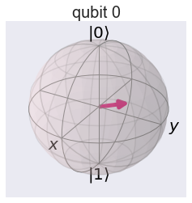

### U-gates

- The U<sub>3</sub>-gate is the most general of all single-qubit quantum gates. It is a parametrised gate of the form:


$$
U_3(\theta, \phi, \lambda) = \left( \begin{array}{cc} \cos(\theta/2) & -e^{i\lambda}\sin(\theta/2) \\\
            e^{i\phi}\sin(\theta/2) & e^{i\lambda+i\phi}\cos(\theta/2)
     \end{array}\right)
$$


- Qiskit provides U<sub>2</sub> and U<sub>1</sub>-gates, which are specific cases of the U<sub>3</sub> gate in which \\( \theta = \tfrac{\pi}{2} \\), and \\( \theta = \phi = 0 \\) respectively. You will notice that the U<sub>1</sub>-gate is equivalent to the R<sub>ϕ</sub>-gate.


$$U_3(\tfrac{\pi}{2}, \phi, \lambda) = U_2 = \frac{1}{\sqrt{2}} \left( \begin{array}{cc} 1 & -e^{i\lambda} \\\
            e^{i\phi} & e^{i\lambda+i\phi}
     \end{array}\right);$$
     
     
$$
U_3(0, 0, \lambda) = U_1 = \left( \begin{array}{cc}
1 & 0 \\\
0 & e^{i \lambda}
\end{array} \right) 
$$


- \\(R_x,R_y, R_z\\) gates are special case of $U_3$ gate.


```python
%matplotlib inline
import numpy as np
import IPython
import matplotlib.pyplot as plt
from qiskit import QuantumCircuit
from qiskit import BasicAer
from qiskit.tools.jupyter import *
from qiskit.visualization import *
import seaborn as sns
sns.set()
```


```python
from helper import *
import os
import glob
import moviepy.editor as mpy
```

#### U Gate (1 qubit)

Lets apply \\( \theta = \pi/3, \phi = pi/3 , \lambda = pi/3 \\) to a single qubit through \\(U_3\\) gate. We can se the rotation in bloch sphere.


```python
qc = QuantumCircuit(1)
qc.u3(np.pi/3,np.pi/3,np.pi/3,0)
style = {'backgroundcolor': 'lavender'}
qc.draw(output='mpl', style = style)
```


- Single qubit state vector


```python
backend = BasicAer.get_backend('statevector_simulator')
job = execute(qc,backend).result()
vec1 = job.get_statevector(qc)
vec1
```


    array([0.8660254+0.j       , 0.25     +0.4330127j])


```python
getBlochSphere(qc)
```





- Matrix 


```python
backend = BasicAer.get_backend('unitary_simulator')
job = execute(qc, backend)
ndArray = job.result().get_unitary(qc, decimals=3)
UM1 = np.matrix(ndArray)
UM1
```


    matrix([[ 0.866+0.j   , -0.25 -0.433j],
            [ 0.25 +0.433j, -0.433+0.75j ]])


####  U Gate (2 qubits)

- Define circuit


```python
qc = QuantumCircuit(2)
qc.u3(np.pi/3,np.pi/3,np.pi/3,0)
qc.u3(np.pi/3,np.pi/3,np.pi/3,1)

style = {'backgroundcolor': 'lavender'}
qc.draw(output='mpl', style = style)
```


- State vector

Lets perform some manual approach for final state in ket notation.


```python
backend = BasicAer.get_backend('statevector_simulator')
job = execute(qc,backend).result()
vec2 = job.get_statevector(qc)
vec2
```


    array([ 0.75      +0.j        ,  0.21650635+0.375j     ,
            0.21650635+0.375j     , -0.125     +0.21650635j])


```python
getBlochSphere(qc)
```


-  Two qubits state vector  as tensor product


    
 Since this circuit consists of pure superposition brought up by $U_3$ gate, it is possible to obtain final state vector by taking direct product of single qubit states. Results from operation of $U_3$ gate on single qubit can be multiplied with direct product operation to get final state.
    
$$  (a|0 \rangle + b| 1\rangle) \otimes (c|0 \rangle + d| 1\rangle) = (ac|00 \rangle + ad|01 \rangle + bc|10 \rangle + bd|11 \rangle $$
    

i.e., 
    
$$\left(\begin{array}{c} 
    a   \\\
    b 
\end{array} \right) \otimes \left( \begin{array}{c} 
    c   \\\
    d 
\end{array} \right) = \left( \begin{array}{c} 
    ac   \\\
    ad \\\
    bc \\\
    bd
\end{array} \right)$$

Where \\( |00 \rangle , |01 \rangle , |10 \rangle \\) and \\( |11 \rangle \\) are basis states for two qubit system.


```python
vec2 = np.kron(vec1,vec1)
vec2
```


    array([ 0.75      +0.j        ,  0.21650635+0.375j     ,
            0.21650635+0.375j     , -0.125     +0.21650635j])


- Matrix Representation

Based on above circuit, lets construct the matrix representation of the circuit using fundamental gates matrices involved in the circuit.

$$ U_3(\theta_1, \phi_1, \lambda_1) = \left( \begin{array}{cc} \cos(\theta/2) & -e^{i\lambda}\sin(\theta/2) \\\
            e^{i\phi}\sin(\theta/2) & e^{i\lambda+i\phi}\cos(\theta/2)
     \end{array} \right)$$

Final Matrix to represent the quantum circuit

$$ U = U_3 \otimes U_3$$


```python
backend = BasicAer.get_backend('unitary_simulator')
job = execute(qc, backend)
ndArray = job.result().get_unitary(qc, decimals=3)
UM2 = np.matrix(ndArray)
UM2
```


    matrix([[ 0.75 +0.j   , -0.217-0.375j, -0.217-0.375j, -0.125+0.217j],
            [ 0.217+0.375j, -0.375+0.65j ,  0.125-0.217j,  0.433-0.j   ],
            [ 0.217+0.375j,  0.125-0.217j, -0.375+0.65j ,  0.433-0.j   ],
            [-0.125+0.217j, -0.433+0.j   , -0.433+0.j   , -0.375-0.65j ]])


```python
UM2_from_UM1 = np.kron(UM1,UM1)
UM2_from_UM1
```


    matrix([[ 0.749956+0.00000e+00j, -0.2165  -3.74978e-01j,
             -0.2165  -3.74978e-01j, -0.124989+2.16500e-01j],
            [ 0.2165  +3.74978e-01j, -0.374978+6.49500e-01j,
              0.124989-2.16500e-01j,  0.433   -1.10000e-05j],
            [ 0.2165  +3.74978e-01j,  0.124989-2.16500e-01j,
             -0.374978+6.49500e-01j,  0.433   -1.10000e-05j],
            [-0.124989+2.16500e-01j, -0.433   +1.10000e-05j,
             -0.433   +1.10000e-05j, -0.375011-6.49500e-01j]])


- Exercise: \\( U_3 \\) Gate (3 qubits)

Consider a 3 qubits quantum circuit with H gate applied to each qubit.


```python
n = 3
q = QuantumRegister(n)
c = ClassicalRegister(n)
qc = QuantumCircuit(q,c)
for k in range(3):
    qc.h(q[k])
qc.barrier()
qc.measure(q,c)
style = {'backgroundcolor': 'lavender'}
qc.draw(output='mpl', style = style)
```


$$\textbf{Exercise:}$$ Using above quantum circuit, find final state vector in ket notation, bloch sphere plot for each qubits.

----------

$$\textbf{Exercise:}$$ Using above circuit, find final state vector by implementing tensor product of three single qubit states.
    
\\( \textbf{Hint} \\): \\(| \psi \rangle =   (a|0 \rangle + b| 1\rangle) \otimes  (c|0 \rangle + d| 1\rangle)  \otimes  (e|0 \rangle + f| 1\rangle)  \\)

--------------

$$\textbf{Exercise:}$$ Using above circuit, find matrix representation of the quantum circuit by implementing tensor product of fundamental gate matrices.
    
\\( \textbf{Hint} :  U = U_3 \otimes U_3 \otimes U_3 \\)

----------------

####  A fun Experiment


```python
qc = QuantumCircuit(2)
for i in range(10):
    qc.u3(np.pi/3,np.pi/6,np.pi/4,0)
    qc.u3(np.pi/6,np.pi/4,np.pi/3,1)
    
style = {'backgroundcolor': 'lavender'}
qc.draw(output='mpl', style = style)
```


- Get Bloch


- Get Phase


```python

```
