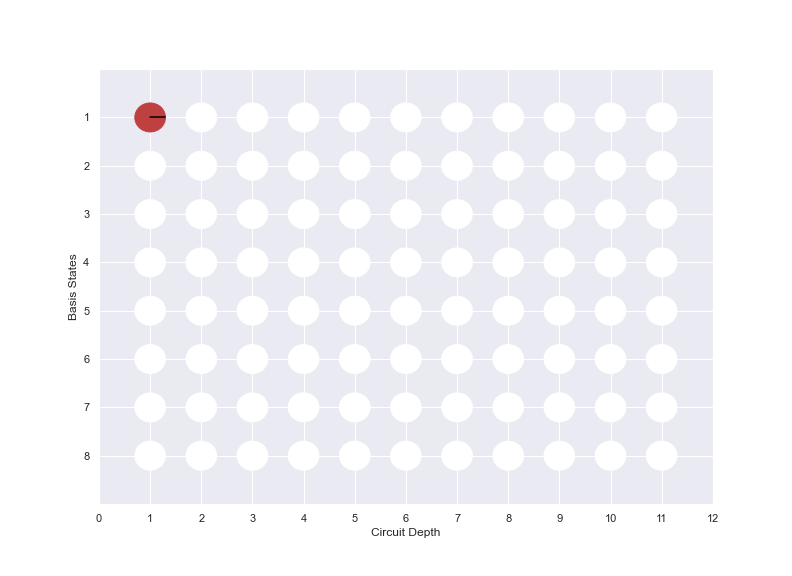

# Quanta.Guru

This online document helps the absolute beginners to persue in the future direction in coding and Quantum Computing. The lesson starts with fundamental of qubits, quantum gates and quantum circuits and quantum algorithms.

##### Qubit

- Qubit
- Single Qubit Gates
- Multiple Qubits Gates

##### QUANTUM GATES

- Hadamard Gate
- U-gates
- Pauli Gates
- R-phi Gates
- CNOT gate

##### QUANTUM CIRCUITS
- Single Qubit Circuit
- Two Qubit Circuit
- Three Qubit Circuit
- Multi Qubit Circuit

##### ALGORITHMS
- Bell State
- Teleportation
- Quantum Parallelism
- Quantum Fourier Transform
- Grover's Algorithms
-Shor's Algorithm

#### Quantum Cryptography
- Quantum Cryptography

      
