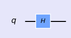
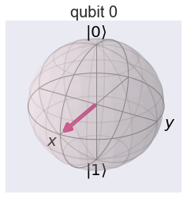
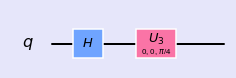
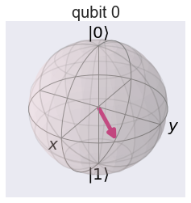
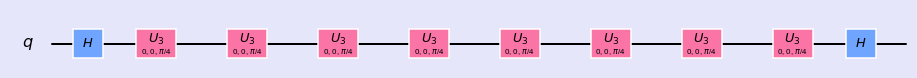

## Qubit


```python
%matplotlib inline
import numpy as np
import IPython
import matplotlib.pyplot as plt
from qiskit import QuantumCircuit
from qiskit import BasicAer
from qiskit.tools.jupyter import *
from qiskit.visualization import *
import seaborn as sns
sns.set()
```


```python
from helper import *
import os
import glob
import moviepy.editor as mpy
```

### What is Qubit?

A single qubit is represented by

$$ |\psi \rangle = \alpha |0\rangle + \beta|1\rangle$$

Or,

$$\vert\psi\rangle = \sqrt{1-p}\vert0\rangle + e^{i \phi} \sqrt{p}  \vert1\rangle$$

### Bloch Sphere

Lets start to make fun with single qubit operation. A quantum circuit with single qubit can be created with following code.


```python
qc = QuantumCircuit(1)
```

This circuit initiate qubit at \\( |0 \rangle \\) state. This qubit can be represented by a Bloch sphere as shown below. Lets print the vector representing this qubit and Plot the Bloch sphere.


```python
print(getStateVector(qc))
getBlochSphere(qc)
```

    [1.+0.j 0.+0.j]


Lets apply Hadamard gate. It will rotate the qubit form \\(|0\rangle\\) state  to the direction of X-axix. i.e. \\( \frac{1}{2}(|0 \rangle + | 1 \rangle)\\). We can also see the corresponding circuit diagram.


```python
qc.h(0)
style = {'backgroundcolor': 'lavender'}
qc.draw(output='mpl', style = style)
```





 Lets print the vector representing this qubit and plot the Bloch sphere.


```python
print(getStateVector(qc))
getBlochSphere(qc)
```

    [0.70710678+0.j 0.70710678+0.j]





Now, our qubit is along the direction of X-axis. Lets try to rotate it about z-axis with \\( \frac{\pi}{4} \\) angle.


```python
qc.u3(0,0,np.pi/4,0)
style = {'backgroundcolor': 'lavender'}
qc.draw(output='mpl', style = style)
```





```python
print(getStateVector(qc))
getBlochSphere(qc)
```

    [0.70710678+0.j  0.5       +0.5j]





Now, you got the idea! Lets rotate to complete \\( 2\pi \\) rotation by adding 7 more u3 gates and return this qubit back to it's initial position by acting final H gate.


```python
for i in range(7):
    qc.u3(0,0,np.pi/4,0)
qc.h(0)
style = {'backgroundcolor': 'lavender'}
qc.draw(output='mpl', style = style)
```





```python
print(getStateVector(qc))
getBlochSphere(qc)
```

    [1.+0.j 0.+0.j]


Yahoo....! Now, qubit is back to original position. This can be shown in animation below.


What happens to the two complex cofficient of the qubit as it passes through the sequence of these gates? We can calculate individual phase angle and magnitude of the complex cofficient and visualize them as shown below.


